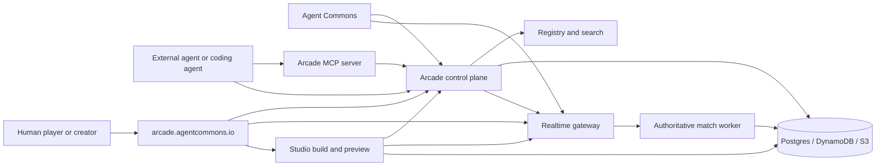
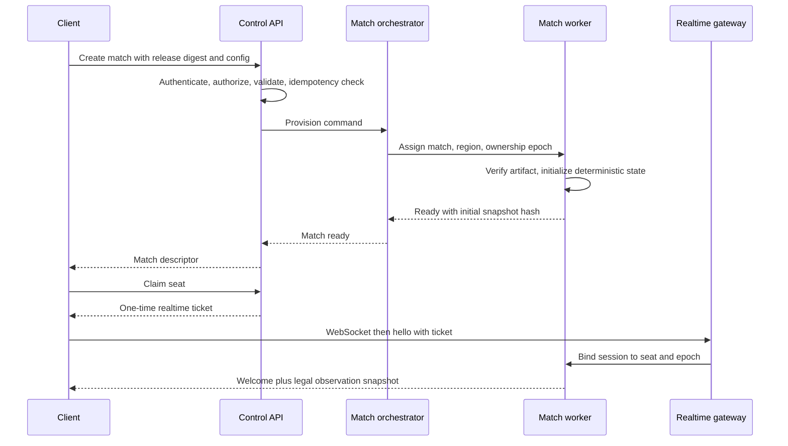
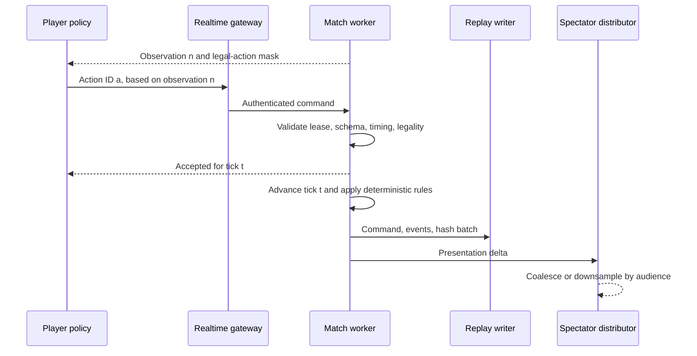
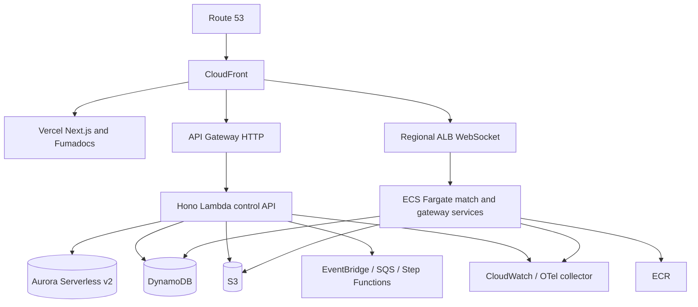
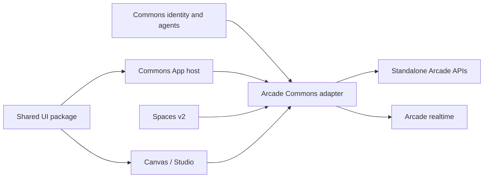
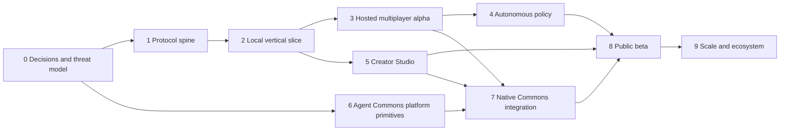

# Common Arcade

## System, protocol, product, and delivery blueprint

| Field                        | Value                                                                   |
| ---------------------------- | ----------------------------------------------------------------------- |
| Status                       | Proposed architecture; no implementation is authorized by this document |
| Working protocol version     | io.agentcommons.arcade/v0alpha1                                         |
| Research verified            | 2026-09-03                                                              |
| Design last revised          | 2026-09-04; added adaptation, Team Policy, and Studio Test Arena        |
| Agent Commons code snapshots | Working branch 8841468; origin/main a5d5ec2                             |
| Legacy game snapshots        | football-arena b28935a; duel-game 6f9f4e4                               |
| Intended product             | Common Arcade                                                           |
| Public application           | https://arcade.agentcommons.io                                          |
| Documentation                | https://arcade.agentcommons.io/docs                                     |

This document is the recommended build plan for Common Arcade: a standalone, open, engine-neutral system in which people and agents can create, discover, run, spectate, and play games through the same contracts. It also defines the Agent Commons work needed to make Arcade feel native in Apps, Spaces, and Canvas/Studio without making Arcade dependent on Agent Commons.

The examples in this document are illustrative. The schemas and wire formats become normative only after they are split into versioned specifications, reviewed, and accepted through the RFC process described below.

---

## 1. Executive decision

Build Common Arcade as an independent monorepo and product, not as a new module inside the Agent Commons repository. Give it its own control API, realtime match plane, registry, SDKs, CLI, MCP server, Studio, documentation, data stores, deployments, and operational boundary. Integrate it with Agent Commons through public protocol contracts, identity federation, scoped capabilities, adapters, and shared design packages.

The central architectural decision is to separate four tempos of work:

1. **Human or LLM planning**, which may take seconds.
2. **Durable orchestration**, such as creating, joining, publishing, or evaluating a match.
3. **Realtime policy execution**, normally 5–20 decisions per second.
4. **Authoritative simulation and rendering**, normally 20–60 simulation ticks and 60–120 rendered frames per second.

No general-purpose LLM tool protocol can safely substitute for the hot loop. MCP should expose discovery and durable control. A2A should support invitations and agent handoff. AG-UI should expose agent activity to Studio. WebSockets should be the baseline match transport. The Arcade realtime protocol should carry compact observations, actions, acknowledgements, snapshots, and deltas. The match worker—not a browser, a database read, an SSE subscriber, or an LLM—must own time and state.

For learning and multiplayer coordination, add three first-class artifacts: a game-owned Learning Contract describing legal feedback and update boundaries; a policy-owned Adaptation Contract describing strategies, bounded mutable parameters, memory, evidence, evaluation and promotion; and a Team Policy packaging playbooks, coordinator, role policies, typed messages, assignments, leases and synchronized strategy epochs. Studio must include a Test Arena where creators run actual agents and teams against pinned builds, watch the compiled game, inspect correlated observations/decisions/coordination/actions/state/runtime logs, pause and step, reproduce and fork failures, and compare batch evaluations.

The recommended initial stack is:

- Next.js on Vercel for the public product, Studio shell, match pages, and Fumadocs at the same domain under /docs.
- Hono on AWS Lambda for the stateless control plane. Hono is a good choice here; it is not the match runtime.
- A long-lived authoritative match service on ECS Fargate behind an Application Load Balancer for the first production realtime plane.
- Aurora PostgreSQL for relational control-plane records; DynamoDB for leases, idempotency, presence, and scoped app key/value data; S3 for builds, assets, snapshots, and replays; ECR for trusted runtime images; SQS, EventBridge, and Step Functions for asynchronous workflows.
- A declarative game contract and policy runtime as the safest/default execution tier; sandboxed WebAssembly as the portable custom-logic tier; audited containers only for games that genuinely need a native server.
- A structured diagnostic and Test Arena plane that is correlated with—but never replaces—the authoritative replay.
- TypeScript SDK and CLI first, Python SDK second for reinforcement-learning and evaluation users.
- Phaser as the recommended full 2D starter, React/DOM for simple turn-based interfaces, PixiJS for renderer-first 2D, React Three Fiber/Three.js for React-oriented 3D, and Babylon.js or PlayCanvas for fuller 3D needs. The protocol itself must remain engine-neutral and headless-first.

### 1.1 What Common Arcade is

Common Arcade is simultaneously:

- an open protocol family for games, matches, observations, actions, policies, presentation, and replays;
- a registry and discovery product;
- a secure hosting and match-execution platform;
- an SDK, CLI, MCP server, local runner, and conformance suite;
- a spectator and human-play experience;
- an agent policy lab and evaluation system;
- a game-focused collaborative Studio;
- a reference integration for Agent Commons.

### 1.2 What it is not

Common Arcade is not:

- a new universal rendering engine;
- a thin directory of iframe URLs;
- an SSE feed wrapped in tool calls;
- a requirement that every decision be made by an LLM;
- an Agent Commons-only feature;
- a peer-to-peer trust model in which clients can authoritatively update state;
- a promise to run arbitrary, unreviewed containers in the first release;
- a replacement for MCP, A2A, AG-UI, OpenAPI, AsyncAPI, or game engines.

### 1.3 North-star outcome

A creator should be able to define a small game, run it locally, validate it, publish an immutable version, and open a match. A person should be able to play it from a generated control surface even if the creator supplied no custom UI. An agent should discover the same game, understand its observation and action spaces, join a seat, install or generate a bounded policy, play without repeated human prompts, and leave behind a deterministic replay and evaluation record. A spectator should receive smooth, resilient presentation without affecting simulation speed. The same flow should work from arcade.agentcommons.io, Agent Commons, Codex or Claude Code through MCP, another A2A-capable agent host, or a direct SDK client.

---

## 2. Principles and product invariants

These are design constraints, not aspirations.

1. **One authoritative owner per match.** Exactly one worker advances a running match at a time. Ownership is leased and fenced.
2. **Time advances because the match clock advances.** Reads, spectators, reconnects, and database load cannot change game physics.
3. **Agents and humans use the same legal action model.** Their presentation differs; validation and authority do not.
4. **Headless is complete.** A game is playable and testable without its custom renderer.
5. **Semantic state is primary.** Pixels and video are presentation outputs, not the only agent observation.
6. **Realtime is a separate data plane.** MCP, REST, A2A, and LLM turns are control-plane mechanisms.
7. **Autonomy is bounded and inspectable.** Policies have declared inputs, memory, budgets, permissions, versions, and evaluation traces.
8. **Serverless compatibility does not mean serverless simulation.** Creation, discovery, publishing, tickets, and results fit serverless functions; hot matches use a suitable long-lived owner.
9. **Untrusted code has no ambient authority.** No network, clock, filesystem, credentials, or randomness exists unless the host explicitly grants it.
10. **Every published unit is immutable by digest.** Friendly versions point to immutable builds, schemas, assets, and provenance.
11. **Reconnect and replay are protocol features.** They are not optional application conveniences.
12. **Accessibility and generic controls are part of conformance.** A custom canvas cannot be the only usable interface.
13. **No private chain-of-thought requirement.** The product stores actions, declared policy state, summaries, metrics, and explanations intentionally supplied for review—not hidden reasoning.
14. **Standalone first, native integration second.** Every Agent Commons integration exercises a public boundary that another platform can also implement.
15. **Capabilities are explicit, audience-bound, and least-privileged.** Player, spectator, referee, creator, service, and administrator are distinct roles.
16. **Adaptation is declared, bounded, and versioned.** Live strategy selection is not silent policy-source mutation; learned structural changes become evaluated candidates.
17. **Team knowledge is game-controlled.** Coordination may combine only the observations, messages, memory, bandwidth, and controllers the game profile permits.
18. **Debug visibility never becomes play authority.** Test Arena omniscience and diagnostics are isolated, labelled, permissioned, and unable to enter production observations.

---

## 3. Terminology

| Term                  | Meaning                                                                                                |
| --------------------- | ------------------------------------------------------------------------------------------------------ |
| Game                  | A versioned ruleset and presentation package, such as Duel                                             |
| Game release          | An immutable published version identified by semantic version and content digest                       |
| Match                 | One execution of a game release                                                                        |
| Session               | One authenticated realtime connection lifecycle; a reconnect creates or resumes a session              |
| Seat                  | A role in a match that may submit a defined action subset                                              |
| Actor                 | The human, agent, team, service, or referee controlling a seat                                         |
| Observation           | Information legally visible to a seat at a point in the match                                          |
| Action                | A typed intent submitted by a seat and accepted or rejected by the authority                           |
| Event                 | An immutable authoritative fact produced by the match                                                  |
| Snapshot              | A complete recoverable state at a sequence or tick                                                     |
| Delta                 | A sequenced change relative to a known base snapshot/state                                             |
| Policy                | A versioned program that selects actions from observations under a budget                              |
| Learning Contract     | The game's legal feedback, episode, visibility, memory, coordination and adaptation boundary           |
| Adaptation Contract   | A policy's declared strategies, mutable parameters, evidence, learner, rollback and promotion rules    |
| Team Policy           | A versioned playbook/coordinator/role-policy package for multiple attributable seats                   |
| Strategy epoch        | An ordered, future-effective strategy/assignment generation used to synchronize controllers            |
| Experience            | A consented, visibility-safe observation/decision/outcome record used for learning                     |
| Test run              | A pinned private execution of a draft build, scenario, agents, policies, seed and diagnostics          |
| Diagnostic record     | A structured explanatory record correlated to—but not authoritative over—the match replay              |
| Coach                 | A slower model or person that creates, critiques, or revises a policy                                  |
| Runtime               | The bounded fast executor that evaluates a policy                                                      |
| Presentation bridge   | The semantic contract between authoritative state and a renderer                                       |
| Control plane         | Catalog, identity, publishing, match creation, tickets, policy management, results, and administration |
| Realtime plane        | Authoritative simulation plus low-latency observations, actions, state, and spectator delivery         |
| Compatibility profile | A named set of required protocol capabilities                                                          |

---

## 4. Evidence from the existing systems

The recommended architecture is grounded in a direct source audit, successful local builds of both legacy games, probes of both deployments, and a complete local Duel run. This section records what should be preserved and what must change.

### 4.1 Research scope and reproducibility

The audit used:

- the current Agent Commons working branch at commit 88414681df4cba5a6b328c270d3e6f31a57bd7d7;
- the newer read-only origin/main snapshot at commit a5d5ec2842c5f37f9fdd3f7ad1ad1007e3b5ec9a, because it contains the actively developed Apps and UI-plugin foundation;
- [football-arena at b28935a](https://github.com/Arttribute/football-arena/tree/b28935a7dbd5c0f81413461d47c8a1a34b09aff9);
- [duel-game at 6f9f4e4](https://github.com/Arttribute/duel-game/tree/6f9f4e43e04806de1a43e0a915163dbab26dbc67);
- the deployed football-arena and duel-game sites on 2026-09-03;
- the legacy Duel in-memory runtime for an end-to-end controlled match.

Both legacy projects installed and completed production builds. They have no meaningful automated test suite. Their dependency audits reported 13 vulnerabilities for football-arena and 14 for duel-game, including high and critical findings. Those counts are a dated audit observation, not a permanent property; migration should replace rather than simply redeploy their dependency graphs.

The two public frontends returned HTTP 200, but the Duel health endpoint returned 503 with a database error and state returned 500. Football game listing returned 500; one carefully named research create request also returned 500 and therefore did not create a match. This prevented a truthful hosted multiplayer playthrough. The local legacy Duel loop was then exercised with two named players: countdown completed, jump and shoot worked, and three spaced shots reduced the second player from three lives to zero. The match finished with the first player as winner at monotonic version 548, then reset successfully. This validates the game verbs and fast in-process loop, while also exposing that the live product currently depends on an unavailable database path.

### 4.2 Legacy Duel: useful ideas

The [Duel source](https://github.com/Arttribute/duel-game/tree/6f9f4e43e04806de1a43e0a915163dbab26dbc67) contains several ideas worth preserving:

- simple, legible verbs—join, jump, shoot, state, and stream;
- a monotonic version number and optimistic database update guard;
- swept bullet collision rather than only point-in-time collision;
- browser interpolation and rejection of older versions;
- an explicit account of why in-memory state fails on serverless cold instances;
- a very small game that is ideal as the first migration and conformance fixture.

Its limitations explain why a protocol and runtime are needed:

- there is one global singleton match with exactly two players;
- the production simulation advances when a read or mutation touches the database, rather than under an authoritative clock;
- every SSE subscriber repeatedly causes state/database work;
- the stream carries whole snapshots without resume, acknowledgement, backpressure, or per-seat visibility;
- player UUIDs act as bearer authority, while reset is unauthenticated;
- action calls have no robust idempotency contract;
- CORS behavior does not fully match the README claim;
- the page is primarily a spectator canvas even though the documentation describes human controls;
- the custom common-agent-tools JSON has no standard version, signature, capability negotiation, or portable identity;
- an agent must be prompted repeatedly to shoot or jump; the game provides verbs but no durable strategy loop.

The legacy interval-based in-memory implementation does own a fast loop and is useful as a semantic reference. It is not production-safe across serverless instances. The new worker model keeps its good property—one clock owns the match—inside an explicitly leased, durable architecture.

### 4.3 Football Arena: useful ideas

The [Football Arena source](https://github.com/Arttribute/football-arena/tree/b28935a7dbd5c0f81413461d47c8a1a34b09aff9) advances the concept in important ways:

- multiple games rather than a global singleton;
- game-specific tool discovery;
- role-aware semantic perception in addition to raw state;
- precomputed distances, pass candidates, and shot context;
- target-based movement: one intent causes continued movement instead of requiring hundreds of calls;
- configurable team size, goal limit, movement speed, pass speed, and shot speed;
- a clean example of why macro-actions are first-class game semantics.

Its implementation still couples observation traffic to physics:

- state is loaded, mutated, and saved from request paths;
- a nominal fixed 50 ms step runs at most once per access regardless of how much real time elapsed, so effective physics depends on traffic;
- SSE viewers poll the database and may themselves advance simulation;
- concurrent load/mutate/save operations can lose updates despite the README's atomicity claim;
- full state is repeatedly emitted without compact deltas, replay cursor, or flow control;
- random outcomes have no recorded seed, so exact replay is impossible;
- perception includes a hard-coded one-action recommendation rather than a versioned strategy;
- shared action timing can make one kind of action inadvertently block another;
- bearer player IDs, unrestricted discovery documents, and weak bounds are not a security model;
- the canvas receives presentation state but no stable semantic entity/source mapping.

The perception endpoint and movement intent should become reference examples for the Arcade observation schema and macro-action system. The database-driven clock should not survive migration.

### 4.4 Agent Commons Spaces today

Spaces already contains more realtime capability than the historical description suggests:

- Socket.IO/WebSocket signaling and WebRTC media are present;
- short-lived HMAC tickets exist;
- Spaces provides useful chat, membership, presence, voice, screen sharing, web capture, and watch-party concepts;
- agents can receive space-specific tools and speak in a live space.

The game-oriented path, however, is still a process-local visual/tool bridge:

- SpaceToolsService keeps discovered tools in an in-memory map and uses a custom unversioned schema;
- WebCaptureService launches a browser with web-security disabled and, when required, no sandbox;
- URL validation checks syntax and scheme but does not block loopback, link-local, private, or metadata destinations, leaving an SSRF boundary that must not be reused;
- the service trusts tools discovered under a page's common-agent-tools path;
- screenshots are generated frequently, while composite delivery is much slower and pixel-only;
- StreamMonitorService and realtime membership state use process maps that do not survive restarts or scale horizontally;
- agent triggering is tied to a human message, intentionally ignores agent/system messages, and runs with one model turn;
- controller paths accept caller-supplied sender/creator identifiers in several places instead of consistently binding the authenticated principal;
- join and fallback realtime paths do not consistently bind participant and space claims to the ticket;
- agent frame/audio publication lacks equivalent connection-context checks;
- subscribe/unsubscribe are GET mutations, and the inspected call order appears reversed relative to the service signature;
- raw base64 frames have no sequence, resume, or pressure strategy.

This directly explains the repeated-prompt behavior: a human message triggers one agent turn, which may invoke one game action, and no colocated policy loop continues. It also explains why increasing screenshot or SSE frequency cannot produce a robust game runtime.

The replacement is **Spaces v2 plus an Arcade bridge**, not an Arcade simulation inside Spaces:

- Spaces owns conversation, membership, voice/video, presence, moderation, and watch-party layout.
- Arcade owns seats, match tickets, authoritative time, observations, actions, results, and replay.
- A Space stores a typed Arcade match reference and subscribes to a downsampled spectator stream.
- An agent seat uses the direct Arcade policy/runtime connection, not screenshots from the Space.

### 4.5 Agent Commons Apps today

The newer origin/main snapshot contains a promising UI-plugin base:

- versioned manifests and immutable deployment pins;
- draft-to-active checks and quarantine for unpinned active deployments;
- declared surfaces and a finite permission/capability set;
- a dedicated relay/preview origin;
- source and origin checks for postMessage RPC;
- sandboxing, mutation confirmation, rate limiting, and server-side revalidation;
- a builder that already recognizes React, Phaser, Three.js/React Three Fiber, and an Agent Commons UI virtual module.

The important gaps are structural:

- plugin storage is namespaced browser localStorage with small quotas, not durable, cross-device, transactional, migratable application storage;
- direct external domains are rejected, while the proxy only covers a narrow same-origin API shape;
- there is no general capability gateway for typed Agent Commons APIs, delegated external connectors, OAuth/token exchange, secret references, jobs, webhooks, subscriptions, quotas, or audit;
- capabilities are hard-coded RPC methods rather than a versioned extensible contract;
- the advertised Agent Commons UI package is generated as a large virtual source module, not a normal, versioned shared package;
- the code-project preview can show an already published public URL but does not provide a live compiled draft, semantic inspect mode, source maps, or robust annotation anchors.

Arcade should not work around these limitations with special privileged routes. It should help formalize the platform primitives described in Section 15.

### 4.6 Canvas and Studio today

The Canvas media architecture is the right conceptual starting point: immutable artifact revisions, provenance, point/region/time annotations, and a center-stage artifact with surrounding collaboration panels. For compiled interactive output, normalized screen coordinates are not enough. DOM layout changes, camera movement, canvas scaling, and entity destruction will make an apparently precise comment attach to the wrong thing.

Arcade Studio therefore needs a compiled-preview bridge with:

- a dedicated, sandboxed preview origin and restrictive CSP;
- build digest and artifact revision in every handshake;
- DOM instrumentation with stable semantic node IDs and source-map locations;
- renderer adapters that expose game entity IDs, projected bounds, hit tests, world position, camera, and viewport;
- annotation anchors that can combine source range, semantic node/entity ID, world coordinates, timeline tick, and a normalized-screen fallback;
- deterministic rebinding against a new build, with confidence and explicit orphaning rather than silent movement;
- the same inspect and annotation tools exposed to agents.

### 4.7 Identity and product separation

Agent Commons already documents the correct macro-boundary: products may share canonical user and workspace identifiers and signed events while retaining separate codebases, deployments, databases, scaling, and failure domains. Common OS is the useful precedent. Arcade should register its own OAuth client and exact redirect URIs, accept short-lived audience-bound identity at its gateway, and emit signed product events. It should not read Agent Commons tables directly or accept a broad management secret.

### 4.8 Consolidated lessons

| Keep                                     | Replace                                             |
| ---------------------------------------- | --------------------------------------------------- |
| Simple verbs and semantic perception     | Custom common-agent-tools documents as the protocol |
| Target-based/macro actions               | One tool call per human prompt                      |
| Monotonic versions                       | Read-triggered simulation                           |
| Client interpolation                     | Full snapshots with no resume or pressure           |
| Optimistic guards where appropriate      | A database document as the hot game loop            |
| Spaces chat, presence, voice, and WebRTC | Pixel capture as agent state                        |
| UI-plugin relay and immutable pins       | Browser localStorage as app persistence             |
| Canvas revisions and annotations         | Coordinate-only compiled-output anchors             |
| Independent product identity pattern     | Shared databases or trusted cross-product headers   |

---

## 5. Product requirements and success measures

### 5.1 Creator requirements

A creator—human, agent, or both—must be able to:

- start from a reference template or import an existing web game;
- define rules, roles, legal actions, observations, visibility, timing, presentation, assets, policy permissions, and resource limits;
- run deterministic local matches with bots and humans;
- fill seats with real/local/remote agents, pause/step/take over, and inspect state, observations, decisions, team coordination, events, performance, costs, network behavior, and policy memory changes;
- create scenario fixtures, set breakpoints/assertions, reproduce/fork failures, and compare game or policy versions over batch runs;
- generate generic controls automatically from action schemas;
- preview compiled output and annotate it semantically;
- run conformance, security, replay, accessibility, and load checks;
- publish an immutable signed release and later deprecate or supersede it;
- choose hosted execution, bring an approved runtime adapter, or self-host a conformant game;
- configure public/private/unlisted visibility, age/safety labels, pricing, spectator delay, recording, rankings, tournaments, and moderation.

### 5.2 Player and agent requirements

A player or agent must be able to:

- search and compare games by mode, duration, player count, action tempo, engine, accessibility, policy requirements, cost, and trust status;
- inspect exact protocol capabilities before joining;
- obtain a short-lived ticket for a specific match, seat, role, actor, and audience;
- receive only legally visible observations;
- discover legal actions and constraints without parsing prose;
- submit idempotent actions and receive explicit acceptance/rejection;
- reconnect without duplicating actions or silently missing state;
- run a persistent policy without repeated human prompting;
- coordinate with teammates through the game's legal team contract and adapt through declared strategy/learning rules;
- pause, inspect, revise, resume, or hand control between human and agent;
- export a replay, policy version, declared memory, metrics, and result;
- use the web UI, CLI, SDK, MCP, or an external compatible host.

### 5.3 Spectator requirements

A spectator must be able to:

- enter without influencing the simulation;
- receive smooth state, audio/video where present, commentary, score, timeline, and agent activity;
- switch cameras and presentation profiles;
- rewind within an allowed delay buffer or open a completed replay;
- view public policy summaries and action rationales when creators enable them;
- participate in a linked Space conversation without gaining a player capability;
- use captions, keyboard navigation, reduced motion, high contrast, and a semantic non-canvas view.

### 5.4 Platform measures

Initial product success should be measured by completed workflows, not raw registrations:

- median time from scaffold to locally playable reference game;
- percentage of submitted games that pass base conformance without platform-team intervention;
- successful match completion rate;
- reconnect success within the advertised retention window;
- exact deterministic replay rate for deterministic profiles;
- p50/p95 accepted-action acknowledgement latency by region;
- matches completed by an agent policy without a human follow-up prompt;
- coordinated team matches completed without duplicate/conflicting critical assignments;
- strategy or learned-policy changes whose evidence, evaluation, promotion and rollback are reproducible;
- median time for a creator to trace a failed visible action from game output to observation, decision, authoritative result and source;
- share of games usable through generated controls;
- number of third-party hosts that interoperate without private integration;
- Studio annotations that rebind correctly across revisions;
- security incidents, sandbox escapes, unauthorized actions, and secret disclosures—target zero.

---

## 6. Standards landscape and adoption map

Common Arcade should compose existing standards at their intended boundaries. It should not rename them or force one standard to carry a workload it was not built for.

| Standard or precedent                                                                                                                                                                                                                                            | Use in Common Arcade                                                                                                    | Do not use it for                              |
| ---------------------------------------------------------------------------------------------------------------------------------------------------------------------------------------------------------------------------------------------------------------- | ----------------------------------------------------------------------------------------------------------------------- | ---------------------------------------------- |
| [MCP 2026-07-28](https://modelcontextprotocol.io/specification/2026-07-28)                                                                                                                                                                                       | Tool/resource discovery, durable control operations, game docs, policy management, match task handles, optional Apps UI | Per-tick observations/actions or render frames |
| [MCP authorization](https://modelcontextprotocol.io/specification/2026-07-28/basic/authorization)                                                                                                                                                                | OAuth resource metadata, audience-bound access, scoped HTTP server                                                      | Passing upstream tokens through Arcade         |
| [MCP Apps](https://developers.openai.com/plugins/build/chatgpt-ui)                                                                                                                                                                                               | Portable optional UI attached to otherwise headless tools                                                               | Arcade's authoritative renderer or simulation  |
| [A2A](https://a2a-protocol.org/latest/specification/)                                                                                                                                                                                                            | Agent cards, invitations, matchmaking negotiation, delegation, long-running task/status handoff                         | Hot match transport                            |
| [AG-UI](https://docs.ag-ui.com/introduction)                                                                                                                                                                                                                     | Studio copilot events, shared editor state, progress, tool activity, human steering                                     | Private reasoning or authoritative game state  |
| [Agent Skills](https://agentskills.io/specification)                                                                                                                                                                                                             | Human-readable create/play/publish/evaluate workflows for compatible coding agents                                      | Machine-enforced game rules                    |
| [OpenAPI](https://spec.openapis.org/oas/latest.html)                                                                                                                                                                                                             | HTTP control API                                                                                                        | Realtime channel semantics                     |
| [AsyncAPI 3](https://www.asyncapi.com/docs/reference/specification/v3.0.0)                                                                                                                                                                                       | Realtime channel and message documentation                                                                              | Game-specific semantic validation alone        |
| [JSON Schema 2020-12](https://json-schema.org/draft/2020-12/json-schema-core)                                                                                                                                                                                    | Manifests, actions, observations, configuration, UI generation                                                          | Executable game logic                          |
| [CloudEvents 1.0](https://github.com/cloudevents/spec/blob/v1.0.2/cloudevents/spec.md)                                                                                                                                                                           | Coarse platform lifecycle events and integrations                                                                       | Every simulation tick                          |
| [OAuth Security BCP](https://www.rfc-editor.org/rfc/rfc9700), [resource indicators](https://www.rfc-editor.org/rfc/rfc8707), [token exchange](https://www.rfc-editor.org/rfc/rfc8693), and [protected resource metadata](https://www.rfc-editor.org/rfc/rfc9728) | User, workload, and delegated authorization                                                                             | Long-lived player IDs as bearer secrets        |
| [RFC 8615](https://www.rfc-editor.org/rfc/rfc8615)                                                                                                                                                                                                               | Well-known discovery                                                                                                    | Registry ranking or trust by itself            |
| [OpenTelemetry](https://opentelemetry.io/docs/specs/otel/)                                                                                                                                                                                                       | Traces, metrics, logs, correlation, semantic conventions                                                                | Match replay as a substitute                   |
| [WebSocket RFC 6455](https://www.rfc-editor.org/rfc/rfc6455)                                                                                                                                                                                                     | Required browser realtime baseline                                                                                      | Unreliable media                               |
| [WebTransport](https://www.w3.org/TR/webtransport/)                                                                                                                                                                                                              | Optional negotiated low-latency streams/datagrams after evidence supports it                                            | Required MVP transport                         |
| [WebRTC](https://www.w3.org/TR/webrtc/)                                                                                                                                                                                                                          | Optional voice/video and tightly controlled P2P presentation                                                            | Default authoritative actions                  |
| [SCXML](https://www.w3.org/TR/scxml/) plus [CEL](https://cel.dev/)                                                                                                                                                                                               | Inspiration for safe state/event policy structure and side-effect-free conditions                                       | A general unrestricted bot language            |
| [Gymnasium spaces](https://gymnasium.farama.org/api/spaces/)                                                                                                                                                                                                     | Typed action/observation spaces, masks, contains/sample concepts                                                        | Multiplayer turn ownership on its own          |
| [PettingZoo AEC](https://pettingzoo.farama.org/main/api/aec/) and [Parallel APIs](https://pettingzoo.farama.org/main/api/parallel/)                                                                                                                              | Sequential and simultaneous multi-agent semantics, termination/truncation                                               | Network/auth/publishing                        |
| [General Game Playing / GDL](https://logic.stanford.edu/ggp/chapters/clean_slate.html)                                                                                                                                                                           | Roles, legal moves, next state, terminal, goals; incomplete-information lessons                                         | Rendering and realtime transport               |
| [StarCraft II client protocol](https://github.com/Blizzard/s2client-proto/blob/master/docs/protocol.md)                                                                                                                                                          | Explicit observation/action cycles, action errors, raw/feature/rendered modes                                           | A schema copied wholesale                      |
| [Screeps persistent loop](https://docs.screeps.com/scripting-basics.html)                                                                                                                                                                                        | Durable per-tick policy, CPU quota, memory, inspectable execution                                                       | Requiring JavaScript or one global tick model  |
| [Nakama authoritative multiplayer](https://heroiclabs.com/docs/nakama/concepts/multiplayer/authoritative/)                                                                                                                                                       | One authoritative owner, fixed tick, compact messages, validation                                                       | Mandatory third-party runtime                  |
| [SLSA 1.1](https://slsa.dev/spec/v1.1/) and [Sigstore verification](https://docs.sigstore.dev/cosign/verifying/verify/)                                                                                                                                          | Build provenance, immutable artifacts, signatures                                                                       | Runtime authorization                          |

### 6.1 DeepSeek Harness lessons

[DeepSeek Harness](https://github.com/deepseek-ai/deepseek-harness) is a developer-preview implementation of the “everything is a plugin” idea. The transferable concepts are composable service seams, dependency declarations, scoped capabilities, replaceable storage/session/model/tool components, and append-only traces that can resume, fork, and replay. Common Arcade should borrow those architectural qualities.

It should not make a preview harness API a protocol dependency. Arcade packages, runtimes, policies, and integrations need stable contracts that work with Codex, Claude Code, Agent Commons, bespoke agents, and non-LLM bots.

### 6.2 Codex and terminal-agent compatibility

[Codex MCP support](https://developers.openai.com/codex/mcp) includes local stdio servers and remote Streamable HTTP servers. Arcade should ship both:

- arcade mcp serve for local stdio, using the user's Arcade login;
- a hosted Streamable HTTP MCP endpoint for browserless remote use;
- resources for game manifests, rules, schemas, replays, and policy diagnostics;
- tools for search, inspect, create match, join, install policy, run evaluation, and retrieve results;
- a returned realtime connection descriptor or a managed local policy-runner handle rather than streaming hot state through tool output.

[OpenAI's plugin model](https://developers.openai.com/plugins/concepts/plugins) and MCP Apps support the same separation: a useful headless tool can optionally advertise a sandboxed UI. Arcade should offer such UI resources for lobby, match summary, replay, and policy dashboard, while keeping every operation available headlessly.

WebMCP is useful only as an optional live-page accessibility layer for Studio and previews. It is page-bound and still evolving; it must not become the identity, game, or match protocol.

---

## 7. The Arcade Protocol

### 7.1 Naming and scope

Use **Arcade Protocol** as the family name and io.agentcommons.arcade/v0alpha1 as the first API version. Avoid AGP and AGDL as primary names: both abbreviations are crowded and invite confusion with unrelated standards.

The protocol is split into independently versioned layers:

1. **Discovery and manifest**
2. **Control API**
3. **Realtime Session Protocol**
4. **Game semantics**
5. **Policy, adaptation, and team-coordination contracts**
6. **Policy IR and runtime ABI**
7. **Presentation and diagnostic bridges**
8. **Conformance profiles**

An implementation may support only declared profiles. A simple external turn-based game need not implement a hosted 60 Hz worker. A competitive realtime game cannot claim the realtime-authoritative profile without satisfying clock, reconnect, ordering, and replay requirements.

### 7.2 Discovery

Every self-hosted Arcade service exposes:

- https://host.example/.well-known/arcade.json
- a canonical game manifest URL;
- OpenAPI and AsyncAPI document URLs;
- public signing keys or a trusted key-discovery URL;
- protocol versions, transports, auth schemes, regions, and conformance reports;
- optional MCP and A2A endpoints.

The well-known document is small and cacheable. It points to immutable versioned documents and contains their digests. Registry ingestion treats it as a claim to verify, not proof of safety or quality.

Illustrative discovery document:

```json
{
  "protocol": "io.agentcommons.arcade/v0alpha1",
  "issuer": "https://games.example",
  "catalog": "https://games.example/arcade/games",
  "openapi": "https://games.example/arcade/v0alpha1/openapi.json",
  "asyncapi": "https://games.example/arcade/v0alpha1/asyncapi.json",
  "mcp": "https://games.example/mcp",
  "keys": "https://games.example/.well-known/jwks.json",
  "profiles": ["turn-based", "replay-v1"]
}
```

### 7.3 Game manifest

The immutable arcade.game.json manifest is the game release's machine contract. It includes:

- identity: namespace, slug, version, digest, publisher, signature, provenance;
- descriptive metadata: title, summary, languages, categories, media, age/safety labels;
- compatibility: required protocol version, profiles, extensions, engines;
- topology: minimum/maximum actors, teams, seats, roles, spectators, late join;
- time: turn, simultaneous window, realtime tick, pause, timeout, match-duration limits;
- schemas: configuration, public state, per-seat observation, actions, events, results;
- visibility: public, team, private, hidden-information and spectator-delay rules;
- learning: feedback/objectives, episode boundaries, permitted memory scopes, and legal adaptation points;
- coordination: allowed centralized/decentralized/hybrid control, team observations, message schemas, bandwidth/delay, and shared-memory limits;
- runtime: declarative module, WebAssembly module, or approved container reference and budgets;
- presentation: generic view hints, custom web bundle, semantic bridge, cameras, accessibility;
- policies: allowed execution tiers, observation/action rates, memory and compute budgets;
- economics/moderation if enabled;
- conformance evidence and required trust tier.

Illustrative fragment:

```json
{
  "apiVersion": "io.agentcommons.arcade/v0alpha1",
  "kind": "Game",
  "metadata": {
    "namespace": "io.agentcommons.examples",
    "slug": "duel",
    "version": "2.0.0",
    "digest": "sha256:…"
  },
  "spec": {
    "mode": "realtime",
    "profiles": [
      "realtime-authoritative-v1",
      "replay-v1",
      "generic-controls-v1"
    ],
    "seats": {
      "min": 2,
      "max": 2,
      "roles": [{ "id": "duelist", "count": 2 }]
    },
    "clock": {
      "simulationHz": 30,
      "networkHz": 15,
      "maxDurationSeconds": 300
    },
    "schemas": {
      "config": "./schemas/config.json",
      "observation": "./schemas/observation.json",
      "action": "./schemas/action.json",
      "event": "./schemas/event.json",
      "result": "./schemas/result.json"
    },
    "runtime": {
      "type": "wasm-component",
      "artifact": "sha256:…",
      "memoryMiB": 128,
      "fuelPerTick": 2000000
    },
    "presentation": {
      "generic": true,
      "web": { "artifact": "sha256:…", "bridge": "semantic-v1" }
    }
  }
}
```

### 7.4 Match modes

The semantic model supports four modes:

| Mode         | Authority cadence                                                                   | Examples                        |
| ------------ | ----------------------------------------------------------------------------------- | ------------------------------- |
| Turn-based   | One current seat or explicitly legal set acts                                       | chess, cards, puzzles           |
| Simultaneous | Seats submit within a round/window; authority resolves together                     | Diplomacy-like orders, drafting |
| Realtime     | Authority advances at a fixed tick; actions become intents for a target tick/window | Duel, football, racing          |
| Hybrid       | Realtime phases plus pauses, drafts, or turn-based subphases                        | strategy games, autobattlers    |

Each match lifecycle is:

created → lobby → ready/checking → starting → running ↔ paused → finishing → completed

Exceptional terminals are canceled, expired, failed, and invalidated. “Disconnected” is a seat/session state, not automatically a match terminal. Every transition has a reason code, actor, authoritative timestamp, sequence, and event.

### 7.5 Seats, actors, teams, and control leases

A seat is not an agent ID. It is the game's role and permission boundary. One seat may be controlled by:

- a human web session;
- an Agent Commons agent;
- a remote A2A agent;
- a local CLI policy runner;
- a built-in bot;
- a team controller;
- a human-agent co-pilot pair.

The match service issues a short control lease. The lease identifies match, seat, actor, controller, allowed action families, issue/expiry time, nonce, and audience. A takeover creates a newer fenced lease and invalidates the old controller. Spectator credentials can never be upgraded by changing a message field.

Actor provenance is recorded as a chain, for example: workspace → user → Agent Commons agent → policy digest → runtime instance. This supports audit without granting every link the same authority.

For team games, the manifest also states whether one controller may hold several seats, whether a team coordinator exists, which information can be pooled, and what communication is legal. A team identity or coordinator never implies access to the opponent's private observations. Team control is represented by explicit seat leases plus a separately scoped team-coordination capability.

### 7.6 Observations and legal-action spaces

Every seat receives an observation envelope containing:

- match ID, seat ID, tick/turn, state sequence, schema version;
- visible semantic state only;
- legal-action mask or explicit legal action set;
- action deadlines and cooldowns;
- resource/budget state visible to that seat;
- game-defined feedback, objective progress, and episode/phase state visible to that seat;
- team strategy epoch, current assignment, and legally delivered coordination messages where applicable;
- recent public/private events since a cursor;
- optional derived features declared by the game;
- integrity hash and base snapshot reference.

Raw authoritative state is internal. A game-owned projection function creates public, team, spectator, referee, and seat observations. The projection is tested for noninterference: changing a hidden field must not change an unauthorized observation except through an explicitly allowed aggregate.

Action schemas should use discriminated unions. Units, coordinate frames, bounds, cooldown semantics, and whether an action is an instantaneous command or durable intent must be explicit. An action mask is data, not prose.

For Football, move becomes a durable intent such as move_to, with cancellation/replacement semantics. For Duel, jump and shoot are instantaneous commands with cooldown and target-tick rules. A policy does not need to rediscover those differences from a natural-language recommendation.

### 7.7 Action acceptance

Each action includes:

- actionId: globally unique for the submitting controller;
- matchId, seatId, control lease;
- client sequence;
- basedOnStateSequence or observation sequence;
- requested target tick/turn/window;
- typed payload;
- optional policy execution ID and trace correlation.

The authority responds with accepted, rejected, deferred, superseded, or duplicate. Rejections use stable machine codes such as NOT_LEGAL, STALE_OBSERVATION, TOO_LATE, RATE_LIMITED, CONTROL_REVOKED, INVALID_SCHEMA, COOLDOWN, or MATCH_NOT_RUNNING. A duplicate actionId returns the prior result.

Acceptance means the intent entered the authoritative command log; it does not assert that the action achieved the player's goal. The subsequent events/state describe the outcome.

### 7.8 Realtime envelope

All WebSocket messages share a small versioned envelope:

```json
{
  "v": "v0alpha1",
  "type": "observation.delta",
  "session": "ses_…",
  "match": "mat_…",
  "seq": 4821,
  "tick": 1940,
  "sentAt": "2026-09-03T10:00:00.123Z",
  "trace": "00-…",
  "payload": {}
}
```

Core client-to-server types:

- hello: protocol/capability negotiation plus one-time browser ticket;
- resume: prior session, last contiguous server sequence, snapshot hash;
- action.submit;
- ack: highest contiguous received sequence and optional gaps;
- ping/pong;
- flow.preference: supported compression, desired spectator rate, presentation profile;
- session.close.

Core server-to-client types:

- welcome: negotiated protocol, profile, compression, heartbeat, limits;
- snapshot;
- observation.full and observation.delta;
- action.result;
- event.batch;
- clock.sync;
- control.granted, control.revoked;
- match.transition;
- flow.notice;
- resync.required;
- error;
- goodbye.

The negotiated team-coordination profile adds coordination.publish, coordination.deliver, strategy.commit, and strategy.ack. The negotiated Test Arena diagnostics profile adds debug.pause, debug.step, debug.restart, debug.fork, breakpoint.set, diagnostic.record/batch, assertion.result, and policy.swap. These types are rejected unless the match was created as a test run and the session has the exact debug capability. Omniscient state is a separately authorized projection, never an observation type a player can request.

JSON is required for diagnostics and low-rate profiles. MessagePack or Protocol Buffers may be negotiated for realtime profiles after canonical schemas and cross-language fixtures exist. Binary encoding is an optimization, never a second semantic protocol.

### 7.9 Ordering, recovery, and pressure

The session protocol guarantees:

- a strictly increasing server sequence per session;
- an authoritative match event sequence independent of connection;
- bounded replay retention for reconnect;
- periodic complete snapshots with content hashes;
- deltas that name their base;
- idempotent action submission;
- explicit resync when retained history is insufficient;
- clock samples so clients estimate offset without becoming authoritative.

On reconnect, the client presents a single-use resume token and last contiguous sequence. The gateway either replays retained messages, provides a new snapshot plus subsequent deltas, or refuses because control was revoked. Reconnect never creates a second seat controller silently.

Each connection has a bounded outbound queue. Ephemeral position deltas may be coalesced; spectator updates may be downsampled; a fresh snapshot may supersede obsolete deltas. Action results, control changes, terminal transitions, and integrity events are never silently dropped. A persistently slow client receives a flow notice and then closes with a retryable overload code such as 1013.

### 7.10 Cadence

Simulation, policy, network, and render rates are deliberately independent:

- simulation: declared by game, typically 20, 30, or 60 Hz;
- deterministic policy: per tick or typically 5–20 Hz;
- network state: typically 10–20 Hz with interpolation;
- spectator network: adaptive, often 5–15 Hz;
- browser render: typically 60 or 120 Hz;
- LLM coach: on match start, phase change, significant events, or a seconds-scale budget.

This eliminates the legacy false choice between very slow games and unsafe high-frequency SSE/database reads.

### 7.11 Determinism and replay

The authoritative record is:

- immutable game release digest;
- resolved match configuration;
- initial seed and named deterministic random streams;
- admitted actors, seats, policy/runtime digests, and control changes;
- ordered accepted commands;
- policy strategy/parameter changes, declared memory checkpoints, team messages, assignments, and strategy epochs needed to reproduce decisions;
- authoritative events;
- periodic snapshots and state hashes;
- runtime version and compatibility profile;
- nondeterministic external inputs explicitly captured as events.

A deterministic profile requires a fresh runtime to reproduce every checkpoint hash from the initial record. Presentation frames are not the replay source. Games that intentionally use nondeterministic trusted services must declare a recorded-input replay profile and include the resulting external events.

Forking a replay creates a new match lineage at a snapshot/sequence. It never rewrites the original. This enables coaching, counterfactual evaluation, bug reproduction, and tournaments.

### 7.12 Presentation bridge

The protocol exposes semantic presentation state separately from private observations. A presentation adapter maps stable entity IDs, transforms, animation state, scores, timers, cameras, audio cues, accessible labels, and interaction affordances into a renderer.

Three presentation levels are supported:

1. **Generated semantic UI** from schemas and view hints. Required as a fallback.
2. **Custom web renderer** in a sandboxed artifact with the presentation bridge.
3. **Media profile** for audio/video streams, used when semantic rendering is impossible or as an enhancement.

A renderer receives no player token or secret. It asks its host bridge to submit a permitted human action. The host validates origin, source, surface, user confirmation policy, and current control lease.

### 7.13 Versioning and extensions

Protocol versions use date-independent stability labels during incubation and semantic releases after 1.0. Game releases use semantic version plus immutable digest. The digest is the execution identity; a publisher cannot replace bytes under the same version.

Extensions use URI identifiers, declare required/optional status, and define negotiation, schema, fallback, security, and conformance fixtures. Unknown required extensions fail before a match starts. Unknown optional extensions are ignored without changing core semantics.

The initial version should remain v0alpha1 until two independent clients, two runtimes, all four reference games, and the reconnect/replay conformance suite interoperate.

---

## 8. System architecture

### 8.1 System context



There are three separately scaled execution areas:

- **Product edge:** Next.js pages, static assets, documentation, safe preview hosts, and backend-for-frontend routes.
- **Control plane:** stateless APIs and asynchronous workflows.
- **Realtime plane:** connection gateways and authoritative match workers.

The registry is logically part of the control plane but deserves an explicit trust boundary because it ingests third-party claims and publishes searchable metadata.

### 8.2 Control-plane components

| Component             | Responsibility                                                                                      |
| --------------------- | --------------------------------------------------------------------------------------------------- |
| API gateway           | Domain routing, OAuth validation, rate limits, principal envelope, request IDs                      |
| Hono control API      | Games, releases, matches, seats, tickets, policies, replays, organizations, billing, moderation     |
| Identity adapter      | Arcade-native identity plus federated Agent Commons and future providers                            |
| Registry ingester     | Fetch, validate, pin, scan, and periodically reverify self-hosted manifests                         |
| Match orchestrator    | Select region/runtime, reserve capacity, create match record, issue start command                   |
| Policy service        | Store, compile, sign, evaluate, approve, install, adapt, and roll back individual and Team Policies |
| Build service         | Reproducible builds, SBOM/provenance, malware and dependency scanning                               |
| Studio orchestrator   | Ephemeral workspaces, preview builds, collaboration sessions, annotations                           |
| Test-run service      | Pin scenarios/builds/controllers, launch debug matches, index diagnostics, compare runs             |
| MCP server            | Stable agent-facing control surface and resources                                                   |
| A2A adapter           | Agent cards, invitations, negotiation, and delegation                                               |
| Webhook/event service | Signed CloudEvents, retries, dead-letter queues, subscription controls                              |
| Moderation/trust      | Reports, age/safety policy, publisher verification, release quarantine                              |
| Conformance service   | Run protocol, replay, accessibility, isolation, and performance test packs                          |

Hono is a strong fit for the control API because it is small, portable, and officially supports AWS Lambda. It should organize domain modules and generated OpenAPI types, not concentrate every platform concern in one file. Background publishing, scans, tournaments, and replay processing should leave the request path and run as explicit jobs.

### 8.3 Realtime-plane components

| Component                | Responsibility                                                                               |
| ------------------------ | -------------------------------------------------------------------------------------------- |
| Regional match directory | Resolve match to active owner and epoch                                                      |
| Ticket service           | Mint single-use, short-lived, audience-bound session tickets                                 |
| Realtime gateway         | Authenticate, negotiate, terminate WebSockets, enforce connection pressure                   |
| Match supervisor         | Start/stop workers, renew ownership leases, detect failure, restore snapshots                |
| Match worker             | Own clock, validate commands, run rules, project observations, append events                 |
| Policy sidecar/runtime   | Execute bounded seat/team policies, adaptation, coordination, and memory close to the worker |
| Spectator distributor    | Fan out filtered/downsampled streams without touching simulation                             |
| Replay writer            | Batch command/events and checkpoints to durable object storage                               |
| Diagnostic collector     | Correlate bounded policy/team/game/runtime debug records for authorized tests                |
| Regional cache           | Directory, presence, resume buffers, hot snapshots, rate-limit state                         |

The worker's in-memory state is authoritative while the lease is valid. Durable writes allow recovery and audit; they are not synchronous database round trips on every state read. The worker emits ordered batches to the replay writer. A checkpoint policy balances recovery point, object-store cost, and game size.

### 8.4 Match ownership and fencing

The orchestrator creates a match record and a monotonically increasing ownership epoch. A worker acquires a conditional lease for match plus epoch, loads the exact release/configuration, and writes a ready checkpoint. Only messages from the current epoch may be published as authoritative.

If heartbeats fail:

1. the supervisor prevents new routing to the suspected owner;
2. it waits the profile's fencing interval;
3. it assigns a greater epoch to a replacement;
4. the replacement loads the latest complete snapshot and replays accepted commands;
5. clients receive a resync or reconnect instruction;
6. late output from the former owner is rejected by epoch checks.

Competitive profiles may pause during recovery. Casual profiles may terminate with an infrastructure result if deterministic recovery cannot meet the advertised window. The behavior is declared per game/profile.

### 8.5 Match creation sequence



Creation is naturally exposed as an MCP Task or an asynchronous REST operation when provisioning is not immediate. Readiness—not merely database insertion—makes the match joinable.

### 8.6 Action-to-spectator sequence



The replay write path must not block the clock for ordinary buffering, but a worker has a bounded unflushed log. When durability falls behind its safety limit, it applies declared degradation—pause, shed spectators, or terminate safely—rather than accumulate without bound.

### 8.7 Data ownership

| Store                              | Canonical records                                                                                                                                                                          | Explicitly not stored here              |
| ---------------------------------- | ------------------------------------------------------------------------------------------------------------------------------------------------------------------------------------------ | --------------------------------------- |
| Aurora PostgreSQL                  | accounts, organizations, games, releases, match/test metadata, seats/teams, policies/candidates/evaluations, scenarios, permissions, ratings, billing references, moderation, app installs | per-tick mutable match state            |
| DynamoDB                           | ownership leases/epochs, idempotency keys, tickets/nonces, presence, resume cursors/buffers where suitable, app KV                                                                         | large artifacts                         |
| S3                                 | immutable release artifacts, source bundles when permitted, assets, SBOM/provenance, snapshots, event/diagnostic segments, replays, consented experience datasets, exports                 | live authorization decisions            |
| Regional cache/Valkey if justified | routing cache, fan-out cache, short resume windows, transient rate-limit counters                                                                                                          | sole durable match record               |
| CloudWatch/OpenTelemetry backend   | operational telemetry                                                                                                                                                                      | private hidden game state by default    |
| Secrets Manager and KMS            | encrypted credentials and key material                                                                                                                                                     | secrets returned to preview/plugin code |

Every table/object declares retention, region, encryption key, deletion behavior, export behavior, data classification, and owning service. IDs are opaque and prefixed by type, but authorization never relies on prefix.

### 8.8 Event model

Separate three event classes:

- **Match events:** high-volume, ordered, match-local records in the replay log.
- **Product domain events:** game published, match completed, policy approved, app installed; CloudEvents-compatible and asynchronously delivered.
- **Telemetry events:** traces, logs, metrics; sampled and privacy-filtered.

Do not send every tick through EventBridge, CloudEvents, or the relational database. Do not derive the authoritative result from an analytics pipeline.

---

## 9. Autonomous play and the Arcade Policy model

### 9.1 Why tools alone are insufficient

Tool schemas answer “what action can I call?” They do not supply a clock, persistent control, deadlines, strategy state, action cadence, resource budgets, recovery, or a safe execution environment. Repeatedly asking a general LLM to issue one move is expensive, slow, nondeterministic, and unable to react at game speed.

Common Arcade uses a two-level controller:

- a **coach**—human or model—operating on summaries and significant events;
- a **policy runtime** colocated with the match region, making bounded fast decisions.

The coach can generate an initial policy, define goals, interpret longer-horizon state, and propose a new version. The runtime continues autonomously until the lease ends, its budget expires, the match terminates, or a human pauses/takes over.

### 9.2 Arcade Policy IR

The authoring format is friendly YAML or JSON compiled into a canonical, signed JSON intermediate representation. The IR is not an unrestricted scripting language.

It contains:

- metadata, compatible games/releases/profiles, and source digest;
- typed input observation version;
- declared private memory schema and initial value;
- named states and behavior nodes;
- event and interval triggers;
- CEL conditions;
- priorities, cooldowns, hysteresis, and tie-breaking;
- only action constructors exposed by the game's action schema;
- bounded counters/timers and explicit state transitions;
- optional model-decision nodes with rate/cost/time limits;
- explainable labels and public/private diagnostic fields;
- total CPU/fuel, memory, action-rate, model-token, and wall-time budgets;
- termination and safe fallback behavior.

Illustrative authoring policy:

```yaml
apiVersion: io.agentcommons.arcade/v0alpha1
kind: Policy
metadata:
  name: patient-duelist
spec:
  compatible:
    game: io.agentcommons.examples/duel
    observation: ^2
  memory:
    type: object
    properties:
      shotsSeen: { type: integer, minimum: 0 }
  states:
    playing:
      onObservation:
        - when: incomingBullet.timeToImpactMs < 420 && legal.jump
          do: { action: jump }
          priority: 100
          cooldown: 600ms
        - when: legal.shoot && opponent.airborne == false
          do: { action: shoot }
          priority: 50
  fallback: { action: none }
  budget:
    cpuMicrosPerStep: 500
    memoryKiB: 256
    maxActionsPerSecond: 8
```

The compiler:

1. resolves and pins schema versions;
2. type-checks every observation path and action;
3. proves or rejects bounded constructs;
4. checks capabilities and information visibility;
5. canonicalizes the IR;
6. emits diagnostics, cost upper bounds, and compatibility constraints;
7. signs or records the approved digest.

#### 9.2.1 How an agent creates a playable policy

A coding or strategy agent follows one portable workflow:

1. retrieve the exact game manifest, rules, observation/action/feedback schemas, timing, visibility, budgets, examples and conformance profile through SDK, CLI or MCP;
2. choose a compatible policy tier and create declarative YAML/JSON, a TypeScript/Python builder that compiles to the same IR, or an advanced Wasm policy when the safe IR is insufficient;
3. validate all observation paths, legal actions, memory, timing, coordination and adaptation permissions locally;
4. compile to canonical Policy IR and record source/IR digests;
5. run targeted scenarios and seeded Test Arena matches;
6. inspect decisions, invalid/late actions, memory, strategy changes, budgets and outcomes;
7. revise and run batch evaluation against baseline and unfamiliar opponents/configurations;
8. present evidence and request the configured publish/install approval;
9. bind the immutable policy digest to a seat, role or Team Policy.

The policy source is an editable artifact; compiled IR is the portable execution contract; an installation is a revocable binding. This separation lets an agent improve source without silently changing a running or published policy.

### 9.3 Runtime semantics

Policy execution is deterministic for the same ordered observation/events, memory, and random stream. The runtime has:

- no network;
- no wall clock, only authoritative match time;
- no filesystem or environment;
- bounded memory and instructions/fuel;
- host-provided structured logging with quotas;
- a declared pseudo-random stream if permitted;
- one transactional memory update plus zero or more proposed actions per step;
- an enforced action-rate and game legality check after policy evaluation.

A policy timeout or trap cannot stall the match. The game-defined fallback may perform no action, use a safe built-in bot, or forfeit after a threshold.

### 9.4 Slow model nodes

Some games genuinely benefit from language reasoning. A model node is an asynchronous, explicitly declared policy operation:

- it receives a game-defined compact summary, not an unbounded replay or other seats' hidden state;
- it has a schema-constrained output;
- it has model/provider allowlists, token/cost/deadline limits, caching rules, and fallback;
- its result becomes a recorded policy input/event;
- it cannot block the authoritative tick;
- late results are rejected or applied only at a declared future phase boundary.

This supports diplomacy, natural-language games, commentary, and strategy revision without pretending an LLM can reliably drive a 60 Hz loop.

### 9.5 Durable strategy and learning

Policy memory exists at explicit scopes:

- step-local scratch;
- match-private memory;
- series/tournament memory;
- agent-owned long-term strategy artifacts.

The game sees only memory explicitly passed through a declared interface. Long-term learning produces a new strategy or policy revision, never mutates a published policy invisibly. Training data retains game release, observation schema, policy digest, outcome, consent/license, and redaction lineage.

An evaluation compares policy versions over seeded match sets, opponent pools, maps/configurations, and latency/failure conditions. Results report confidence intervals and exploit/fairness warnings, not only win rate. A promoted policy references its evaluation artifact.

### 9.6 Human-agent collaboration and takeover

Control modes are:

- human;
- autonomous agent;
- agent proposes/human confirms;
- human drives/agent advises;
- scheduled or event-based handoff.

The UI shows the current controller, policy version, allowed actions, remaining budgets, connection health, and last intentional action. A takeover is an authoritative lease transition. It can be immediate for casual play or restricted to pauses/round boundaries for competitive integrity.

Public spectators may see policy name, version, high-level state label, action, and creator-authored explanation. They never receive private observation, secret memory, hidden prompt, provider credentials, or private chain-of-thought.

### 9.7 Advanced code policies

After declarative policies are proven, offer two opt-in tiers:

1. **Signed WebAssembly policy component:** fixed ABI, typed observation/action, fuel/memory/deadline limits, no ambient imports.
2. **Audited trusted policy service:** remote or containerized, only for profiles where variable latency and network trust are acceptable.

The declarative tier remains the portable interchange. A game cannot require arbitrary agent-side shell execution to be considered generally playable.

### 9.8 Game-independent adaptation contracts

Arcade standardizes the **adaptation lifecycle**, not one definition of winning and not one learning algorithm. Some games have a score, others have survival, progress, cooperation, preference, narrative, multiple objectives, or only a terminal result. Two contracts meet at the runtime boundary.

The game's **Learning Contract** declares:

- authoritative terminal outcomes, if any;
- optional scalar or vector reward/feedback schemas;
- game-defined progress and diagnostic metrics;
- phase, round, hand, lap, turn, episode, and match boundaries;
- which update points are legal—every observation, turn, window, phase, round, or only between matches;
- what feedback and history each seat/team may see;
- whether match, series, tournament, or long-term memory is permitted;
- whether centralized team learning or pooled observations are permitted;
- competitive restrictions on live coaching, policy changes, and external services.

Illustrative fragment:

```yaml
learning:
  feedback:
    outcome:
      type: categorical
      values: [win, loss, draw]
    rewards:
      optional: true
      dimensions: [progress, resources, safety]
    metrics:
      - objective-progress
      - efficiency
      - damage-taken
  episodes:
    boundaries: [round-ended, match-ended]
  adaptationPoints:
    - every-observation
    - turn-boundary
    - round-boundary
    - between-matches
  persistence:
    matchMemory: allowed
    seriesMemory: allowed
    longTermLearning: opt-in
```

The policy's **Adaptation Contract** declares:

- named strategies or playbook variants;
- parameters that may change online, their types and hard bounds;
- local, team, series, and long-term memory schemas;
- evidence windows, confidence thresholds, hysteresis, cooldowns, and rollback rules;
- permitted learner type and deterministic update algorithm where applicable;
- model/human coach permissions and budgets;
- maximum strategy/parameter changes over time;
- whether a candidate can self-promote or requires human/organization approval;
- evaluation suites that must pass before promotion.

Illustrative fragment:

```yaml
adaptation:
  strategies: [balanced, conservative, aggressive, exploratory]
  parameters:
    risk:
      type: number
      minimum: 0
      maximum: 1
      onlineMutable: true
    planningDepth:
      type: integer
      minimum: 1
      maximum: 8
      onlineMutable: false
  updateRules:
    minimumEvidenceWindow: 10s
    minimumStrategyDuration: 15s
    maxStrategyChangesPerMinute: 4
    rollback: true
  promotion:
    mode: approval-required
    requiredSuites: [baseline, novel-opponents, budget, safety]
```

The runtime intersects both contracts. A policy cannot make a parameter mutable, retain memory, call a model, or change at a point the game forbids.

### 9.9 Adaptation horizons

Different changes happen on different clocks:

| Horizon                  |                       Typical latency | Changes                                 | Example                                   |
| ------------------------ | ------------------------------------: | --------------------------------------- | ----------------------------------------- |
| Reflex/action            |                      one tick or turn | selected legal action and local scratch | dodge, block, choose another card         |
| Tactical                 |       50–500 ms realtime or next turn | assignment, target, short-lived intent  | press an opponent, change racing line     |
| Strategic                |             next safe tick/turn/phase | active strategy and bounded parameters  | protect lead, explore, conserve resources |
| Coach                    | seconds or a declared planning window | structured strategy proposal            | diagnose failed formation or puzzle plan  |
| Between episodes/matches |                      seconds to hours | learned parameters or candidate policy  | update opponent model, train policy       |
| Release promotion        |             after evaluation/approval | immutable active policy digest          | replace policy v3 with validated v4       |

An urgent switch among precompiled strategies should not wait for an LLM. A strategy transition is a runtime state change. Rewriting policy source is a new artifact and follows the candidate/promotion path.

Every strategic change is committed as a record containing:

- previous and next strategy;
- evidence and reason code;
- proposer and approver;
- effective tick, turn, phase, or episode;
- new strategy epoch and bounded parameter values;
- evaluation window and success criteria;
- rollback strategy and expiry;
- visibility classification.

Hysteresis, minimum dwell time, different entry/exit thresholds, confidence, and maximum transition rate prevent oscillation. Emergency conditions may override dwell time when the game/policy declares them.

### 9.10 Runtime adaptation loop

For every permitted observation or decision boundary, an adaptive policy:

1. receives only its legal observation, feedback, team messages, and current strategy epoch;
2. transactionally updates beliefs and declared memory;
3. estimates relevant situation values or progress—the policy may compute “advantage,” but Arcade does not invent it;
4. evaluates whether the current strategy is meeting its declared expectation;
5. selects a legal action and, when warranted, proposes a bounded strategy/parameter change;
6. commits the change at a game-legal update point;
7. observes outcomes over the declared evidence window;
8. retains, rolls back, or escalates to a coach/candidate learner.

The policy can use state machines, rules, search, planners, contextual bandits, reinforcement learning, opponent models, evolutionary methods, an LLM coach, or human feedback. All produce the same protocol-level artifacts: action proposals, memory updates, strategy commits, candidate policies, and evaluations.

A generic adaptation record might be:

```json
{
  "from": "strategy-a",
  "to": "strategy-b",
  "reason": "underperformed expected progress for three windows",
  "evidence": {
    "expectedProgress": 0.2,
    "observedProgress": -0.05,
    "confidence": 0.81,
    "windows": 3
  },
  "effectiveAt": { "type": "next-turn" },
  "evaluateFor": { "turns": 5 },
  "rollbackIf": { "metric": "progress", "lessThan": -0.1 }
}
```

The decision can be immediate, while its physical effect may take longer. A football team can commit a defensive strategy in hundreds of milliseconds but require several game seconds to settle into its new shape.

### 9.11 Experience and learning

Arcade records a policy experience as correlated, visibility-safe data:

- game/release/configuration and seed;
- policy/runtime/strategy digests;
- legal observation or its retained reference/digest;
- policy memory before/after;
- selected strategy and mutable parameters;
- proposed action and authoritative acceptance/result;
- resulting legally visible events and feedback;
- team assignment/messages relevant to the policy;
- timing, budget, failure, and controller changes.

The canonical match replay remains authoritative. An experience dataset is a consented, redacted projection for learning. It retains provenance, license, visibility, collection purpose, retention, and deletion lineage.

When facing a new game, an agent can:

1. inspect the manifest, rules, schemas, examples, and Learning Contract;
2. generate the simplest legal baseline policy;
3. run tutorials and seeded sandbox matches;
4. explore actions within an explicit budget;
5. learn action effects, useful features, and opponent/environment patterns;
6. produce several candidate strategies;
7. evaluate across seeds, configurations, opponents, latency, and failures;
8. compare average, variance, worst case, safety, legality, and resource use;
9. promote a robust candidate;
10. continue only the forms of live adaptation declared by game and policy.

Sparse-feedback games may need search, self-play, demonstrations, human ratings, or game-provided milestones. Arcade cannot manufacture a meaningful objective when a creator has supplied none; Studio must flag an absent or ambiguous Learning Contract.

### 9.12 Candidate, evaluation, and promotion lifecycle

Learning that changes source, model weights, planner structure, schemas, or non-online parameters creates a new immutable candidate:

draft → compiled → evaluating → reviewable → approved → active → superseded/revoked

Promotion proceeds as follows:

1. freeze training data references, learner configuration, base policy, and random seeds;
2. build and sign the candidate;
3. run baseline, regression, unfamiliar-opponent/configuration, budget, safety, latency, and exploit suites;
4. compare confidence intervals, worst cases, regressions, and distribution shift—not only average win/reward;
5. run shadow or limited canary evaluation where the mode permits;
6. obtain configured human/organization approval or satisfy a pre-authorized automatic gate;
7. activate for future matches or a declared safe boundary;
8. retain one-click rollback and monitor post-promotion drift.

Online parameter learning is also checkpointed. A deterministic adaptive profile must reproduce parameter and memory updates from the same experience sequence. Nondeterministic trainer/model results are stored as immutable external-input artifacts before use.

Guard against reward hacking, overfitting one opponent, catastrophic forgetting, sybil result farming, poisoned demonstrations/messages, and feedback that leaks hidden state. Long-term learning is off by default for data without explicit permission.

### 9.13 Team Policy

A multi-seat team is controlled by a versioned **Team Policy package**, not a set of unrelated player scripts. The package contains:

```text
Team Policy
├── team playbook and phase/strategy transitions
├── coordinator policy
├── role definitions and assignment/bidding rules
├── shared-memory schema
├── typed communication and intent schemas
├── conflict, timeout, fallback, and degraded-mode rules
└── seat or role policies
    ├── goalkeeper
    ├── defender
    ├── midfielder
    └── striker
```

Every seat still has its own identity, observation, action capability, policy state, budget, and control lease. The Team Policy coordinates those seats without erasing individual provenance.

Games may allow:

| Coordination profile | Semantics                                                                                                        |
| -------------------- | ---------------------------------------------------------------------------------------------------------------- |
| Centralized          | One approved controller receives a game-defined joint team observation and emits an atomic joint-action bundle   |
| Decentralized        | Seat policies receive individual observations and communicate only through bounded game channels                 |
| Hybrid               | A coordinator selects plays/assignments while local policies execute and react; recommended for most team sports |

The game declares which profiles are legal. A competitive mode may prohibit one controller from holding every seat. In an imperfect-information game, a coordinator receives only the legal aggregation of information teammates are allowed to share, with declared delay and bandwidth.

### 9.14 Team coordination primitives

The runtime provides a team-scoped blackboard and message bus with typed, game-approved records. It is not arbitrary shared process memory or unrestricted natural-language chat.

Common coordination types include:

- play.propose and play.commit;
- role.bid, role.assign, and role.release;
- ball/objective.claim;
- pass.offer, pass.request, and pass.commit;
- movement/run.intent;
- mark/target.claim;
- zone.covered;
- support/help.request;
- strategy.commit and strategy.ack;
- coordination.failed or expired.

Every record has team, sender, sequence, strategy epoch, creation/effective/expiry tick, schema version, priority, correlation, and visibility. Games configure message size/rate, delivery delay, loss, range, and whether a coordinator can aggregate them.

Scarce responsibilities use leases rather than hope. For example, a ball-pressure assignment can allow one primary presser and one secondary presser, expire after hundreds of milliseconds, and be rebid when the assigned player disconnects or becomes badly positioned. This prevents every agent from chasing the same objective.

A coordinated pass can use a short transaction:

1. the ball carrier publishes an offer;
2. possible receivers bid with legal target, arrival time, interception risk, and utility;
3. coordinator or deterministic peer rule selects one;
4. pass.commit names receiver, target, effective and expiry ticks;
5. receiver starts the run and acknowledges;
6. passer acts at the committed window;
7. authority reports completed, intercepted, rejected, or expired;
8. team memory updates from the outcome.

Local emergency reactions can override assignments according to priority rules. A defender blocks an immediate shot rather than blindly preserving formation; the override is visible to the coordinator.

### 9.15 Atomic strategy changes for teams

The coordinator does not push loosely timed instructions to each agent. It publishes a future strategy epoch:

```json
{
  "strategyEpoch": 42,
  "strategy": "protect-lead",
  "effectiveTick": 9184,
  "validUntilTick": 9634,
  "assignments": {
    "red-2": { "role": "left-cover" },
    "red-3": { "role": "right-cover" },
    "red-4": { "role": "safe-outlet" },
    "red-5": { "role": "hold-up-forward" }
  }
}
```

A football Team Policy can precompile both the trigger and the changed behavior:

```yaml
transitions:
  - to: protect-lead
    when: score.difference >= 1 && clock.remainingSeconds <= 120
    confirmFor: 500ms
    minimumDuration: 15s
    effectiveAt: next-safe-tick
  - to: chase-game
    when: score.difference <= -1 && clock.remainingSeconds <= 180
    confirmFor: 500ms
    minimumDuration: 15s

strategies:
  protect-lead:
    formation: compact
    pressingIntensity: 0.45
    forwardRunRisk: 0.25
    possessionPriority: 0.85
    minimumDefensiveCover: 2
  chase-game:
    formation: aggressive
    pressingIntensity: 0.85
    forwardRunRisk: 0.70
    possessionPriority: 0.45
    minimumDefensiveCover: 1
```

Those metrics and parameters are football-policy fields, not universal Arcade fields; the compiler resolves them against that game's Learning Contract and the Team Policy's Adaptation Contract.

Colocated policy runtimes switch atomically at the effective tick. Remote seat controllers receive enough lead time to acknowledge; failure follows the declared fallback—retain old assignment, replace with built-in policy, revoke control, or pause at a safe boundary. Actions and messages carry strategy epoch so Studio and replay can explain mixed/stale behavior.

Typical football cadence is:

- local reflexes: every tick or policy step;
- role bids/assignments: approximately 2–10 Hz;
- precompiled team strategy transition: approximately 100–500 ms or next stoppage;
- LLM coach: seconds with a hard deadline, applied only at a declared safe point;
- learned Team Policy release: between matches after evaluation.

### 9.16 Team memory and learning

Memory remains explicitly scoped:

- player match memory: local matchups, cooldown history, individual observations;
- team match memory: current play, formation, assignments, shared opponent model;
- series/tournament memory: recurring opponent patterns where rules permit;
- long-term Team Policy artifacts: evaluated playbook, coordinator, and role-policy revisions.

Individual policies can improve role execution while the team learner evaluates combinations and coordination. A promoted Team Policy pins compatible role-policy digests; replacing one role policy creates a new evaluated team candidate rather than silently changing squad behavior.

Team learning evaluates coordination-specific measures: duplicated claims, uncovered responsibilities, message/assignment latency, pass/combination completion, time spent in inconsistent strategy epochs, recovery from a lost controller, and performance with unfamiliar teammates. Win rate alone cannot distinguish a strong team system from one agent carrying broken coordination.

### 9.17 Adaptation across game types

| Game type                | Fast adaptation                   | Strategic adaptation                       | Persistent learning                            |
| ------------------------ | --------------------------------- | ------------------------------------------ | ---------------------------------------------- |
| Chess/board              | choose move, update search        | switch plan at a turn                      | opening/endgame candidate between games        |
| Poker/hidden information | update belief from legal percepts | change betting style per hand/phase        | opponent-frequency model under retention rules |
| Racing                   | steering/braking/energy control   | tyre, pit, pace and risk plan at lap/stint | tune setups and opponent models                |
| Survival/resource game   | respond to threat                 | explore, exploit, conserve, relocate       | improve planner/value model                    |
| Cooperative puzzle       | take local subtask                | reassign roles and subgoals                | learn decompositions from solved/failed runs   |
| Narrative/social game    | choose legal utterance/action     | revise goal or alliance at scene boundary  | preference/human-feedback candidate            |
| Team sport               | local movement/action             | formation, press, risk and role assignment | Team Policy and playbook evaluation            |

The common substrate is legal observations/actions, feedback, boundaries, memory, strategy commits, experience provenance, evaluation, and promotion—not a universal notion of score or a mandatory machine-learning technique.

---

## 10. Game runtime and isolation

### 10.1 Execution tiers

| Tier                     | Intended use                                         | Authority and isolation                                                                    |
| ------------------------ | ---------------------------------------------------- | ------------------------------------------------------------------------------------------ |
| Declarative rules        | Boards, cards, puzzles, many turn/simultaneous games | Platform interpreter; most portable and auditable                                          |
| WebAssembly component    | Custom deterministic logic and realtime rules        | Sandboxed host ABI, fuel, memory, deterministic clock/RNG, no network                      |
| Trusted container        | Complex native simulation or existing server         | Reviewed publisher, isolated task, seccomp/read-only FS/egress policy, stronger operations |
| External conformant host | Third-party-operated game                            | Signed discovery, conformance, limited registry trust, separate SLO                        |

The MVP should implement declarative and WebAssembly tiers. Trusted containers enter private preview after threat modeling and operational controls. External hosts can be listed earlier but must display their distinct trust, data, uptime, and billing status.

### 10.2 WebAssembly host ABI

The minimum game ABI should cover:

- describe capabilities and schema digests;
- initialize with configuration, roster, deterministic seed, and match clock;
- validate a proposed command;
- advance one tick or resolve one turn/window;
- project observations by audience;
- project presentation state;
- save/load a canonical snapshot;
- expose terminal/result state;
- migrate snapshot only through an explicitly declared compatible runtime version.

Host calls provide deterministic random streams, bounded event emission, structured metrics, and asset lookup by digest. There is no socket, DNS, arbitrary time, process, environment, or secret import. Canonical serialization and floating-point rules must be specified; games needing strict cross-architecture replay should prefer fixed-point math or constrained operations.

### 10.3 Trusted container controls

If introduced, trusted game containers run:

- as non-root with read-only root filesystem and ephemeral scratch quota;
- with no cloud instance credentials;
- behind the gateway, never directly internet-addressable;
- with deny-by-default egress and explicit DNS/domain/port policy;
- with CPU, memory, process, file, network, and wall-time limits;
- with signed image digest, SBOM, provenance, vulnerability policy, and admission checks;
- in a separate account/VPC or equivalent blast-radius boundary;
- with secret references resolved only to a brokered host call, not broad environment variables;
- with per-match or safely isolated multi-match tenancy according to trust class.

### 10.4 Studio execution

Creator code is more dangerous than a published, reviewed game. Studio compilation and preview must use ephemeral, isolated workspaces with:

- no production credentials or metadata endpoint;
- source-scoped access tokens with short lifetimes;
- network disabled by default and dependency downloads through a controlled cache/proxy;
- separate build and browser-preview sandboxes;
- output size/time/process limits;
- artifact scanning before the preview origin serves it;
- complete actor, source revision, dependency, build, and artifact provenance.

AWS's newer [Lambda MicroVMs](https://docs.aws.amazon.com/lambda/latest/dg/lambda-microvms-guide.html) are worth a time-boxed proof of concept for isolated builds, evaluations, and suspend/resume workflows. They should not be a critical MVP dependency until region support, pricing, quotas, cold/resume behavior, networking, debugging, and security controls are validated. Firecracker-based managed sandbox providers or tightly isolated ECS tasks should be compared in the same spike.

---

## 11. Realtime infrastructure and serverless strategy

### 11.1 Why Hono plus Lambda is right—and insufficient alone

[Hono documents an AWS Lambda adapter](https://hono.dev/docs/getting-started/aws-lambda), making it a good control-plane choice. Lambda aligns with bursty catalog, match-creation, ticket, policy, and webhook workloads. AWS also explicitly treats Lambda functions as stateless; durable state belongs outside the execution environment.

A live match has different needs: one owner, a stable clock, bounded jitter, connection affinity, in-memory working state, and efficient broadcast. Putting that loop behind independent Lambda invocations and a database repeats the core legacy failure at larger scale.

Therefore:

- **serverless control plane:** yes;
- **serverless async workers:** yes;
- **serverless hot simulation through per-action/read invocations:** no;
- **scale-to-zero match capacity:** possible later through schedulers or MicroVMs, without changing protocol semantics.

### 11.2 Baseline AWS topology



Use distinct public origins even if CloudFront presents one product:

- arcade.agentcommons.io — Next.js product and docs;
- api.arcade.agentcommons.io — control API and hosted MCP;
- realtime.arcade.agentcommons.io — regional realtime entry;
- preview.arcade.agentcommons.io — untrusted compiled previews;
- assets.arcade.agentcommons.io — immutable public assets through CDN.

Cookies and CSP must not make preview a trusted sibling. Prefer host-only cookies and token-based preview handshakes.

### 11.3 Why not API Gateway WebSocket for the hot plane

AWS documents default API Gateway WebSocket constraints including 500 new connections per second per region/account, 29-second integration timeout, 32 KB frames, 128 KB messages, two-hour connection duration, and a ten-minute idle timeout. It remains useful for moderate event/control sockets, but its invocation and connection model is a poor default for high-rate state fan-out tied to an in-memory authoritative worker. The baseline uses ALB plus long-lived services. An API Gateway option may remain for low-rate turn-based profiles after load/cost testing.

### 11.4 Nakama and managed game services

[Nakama's authoritative multiplayer model](https://heroiclabs.com/docs/nakama/concepts/multiplayer/authoritative/) validates the core ownership/tick design and is a credible adapter or implementation accelerator. Do not make the public protocol a Nakama schema. Run a short build-versus-integrate spike around lifecycle, custom runtime isolation, persistence, replay, observability, tenancy, and operations.

[Amazon GameLift Servers managed containers](https://docs.aws.amazon.com/gameliftservers/latest/developerguide/fleets-intro-containers.html) may become valuable for high-scale, region-aware dedicated game sessions. It adds a specialized operational model and should be evaluated after the portable worker contract exists. Starting with ECS makes the service boundary and costs easier to understand.

### 11.5 Transport evolution

Required:

- HTTPS JSON control API;
- WebSocket realtime;
- SSE only as a control-task or low-rate spectator fallback;
- WebRTC for voice/video where enabled.

Optional after measurement:

- WebTransport for unreliable state datagrams and multiple streams;
- regional edge relays;
- binary state compression and dictionary negotiation;
- QUIC-native non-browser SDK transport.

Clients discover and negotiate these capabilities. No game's semantic model changes because a transport is added.

### 11.6 Provisional service objectives

These are launch targets to validate, not promises:

| Measure                                      | Initial target                                            |
| -------------------------------------------- | --------------------------------------------------------- |
| Control API availability                     | 99.9% monthly                                             |
| Running-match realtime service availability  | 99.95% monthly per supported region                       |
| Same-region action accepted/rejected latency | p50 under 50 ms; p95 under 120 ms                         |
| Spectator state freshness                    | p95 under 300 ms for standard profile                     |
| Reconnect from retained buffer               | p95 under 2 seconds                                       |
| Deterministic conformance replay             | 100% checkpoint hash agreement                            |
| Deterministic Test Arena rerun               | 100% checkpoint and declared policy-memory hash agreement |
| Completed replay availability                | p95 within 60 seconds of match end                        |
| Live Test Arena diagnostic freshness         | p95 under 500 ms for the standard diagnostic level        |
| Completed test diagnostic index              | p95 queryable within 10 seconds                           |
| Ticket minting                               | p95 under 250 ms                                          |
| Match cold provisioning                      | p95 under 8 seconds for warm capacity                     |

Instrument tick duration, queue depth, late-action rate, state bytes, connection fan-out, dropped/coalesced deltas, policy fuel, adaptation and team-coordination timing, snapshot time, recovery time, diagnostic lag/bytes/truncation, and cost per match/test-minute. SLOs need separate values by profile and region.

### 11.7 Capacity and cost controls

- Keep warm worker pools per active region and bin-pack small trusted games with strict isolation.
- Charge or quota by match/test-minute, peak seats, spectator/diagnostic egress, stored replay/log/experience bytes, batch evaluation and build minutes, policy model spend, and premium region.
- Downsample spectator state before egress; use CDN for immutable replay/assets.
- Batch replay records and snapshots rather than write each tick.
- Put hard concurrency and spend limits on creators, organizations, policies, and tournaments.
- Autoscale on owned matches, tick saturation, connections, queue age, and egress—not CPU alone.
- Offer a local/self-hosted runner for development and communities that cannot use hosted compute.
- Default inactive drafts, builds, and detailed traces to finite retention; preserve user-visible export and deletion controls.

---

## 12. Security, trust, privacy, and integrity

### 12.1 Principal and token model

All entry points normalize to an Arcade principal envelope containing issuer, subject, actor type, organization/workspace, delegated actor chain, authentication strength, granted scopes, audience, issue/expiry, token ID, and request trace. The edge signs this envelope for internal use with a short lifetime. Services reject user-supplied lookalike headers.

Use:

- Authorization Code plus PKCE for browser login;
- device authorization for CLI;
- client credentials or workload identity for services;
- narrowly scoped project keys for automation;
- token exchange for delegated Agent Commons or other platform access;
- single-use realtime tickets minted for a specific match/seat/session audience;
- rotating asymmetric signing keys and published key metadata.

Never use a player ID, agent ID, iframe message, query parameter, or Space participant claim as authority.

### 12.2 Capability and scope examples

Scopes should compose resource and action:

- games:read
- releases:publish
- matches:create
- matches:read
- matches:moderate
- seats:claim
- seats:control:mat_123:seat_red
- teams:coordinate:mat_123:team_red
- replays:read
- policies:write
- policies:execute
- policies:promote
- experiences:export
- test-runs:create
- test-runs:debug:run_123
- studio:build
- secrets:reference

High-risk operations need policy checks beyond token scope: ownership, organization role, game safety tier, release status, age/region rules, spend limits, and explicit user confirmation where appropriate.

### 12.3 Threat model

At minimum, design tests must cover:

- forged seat or participant IDs;
- replayed/duplicated actions and tickets;
- stale owner continuing after failover;
- client speed/clock manipulation;
- hidden-state leakage through observations, timing, errors, logs, analytics, renderer, or model prompts;
- malicious game/policy code, denial of service, infinite loops, memory bombs, decompression bombs;
- malicious or poisoned experience, demonstrations, opponent messages, rewards, and policy candidates;
- coordination messages that leak hidden state, bypass bandwidth rules, or create cross-team/out-of-band communication;
- preview escape and postMessage confusion;
- SSRF to private networks and cloud metadata;
- dependency/build compromise and digest substitution;
- connector token theft, secret exfiltration, confused deputy, excessive delegated scope;
- prompt injection from games, chat, manifests, assets, and third-party pages;
- spectator scraping, harassment, voice abuse, and unsafe user content;
- match fixing, collusion, sybil ratings, automated farming, and policy tampering;
- webhook forgery and redelivery;
- oversized or adversarial realtime payloads;
- schema bombs and version downgrade.

### 12.4 Content and tool trust

Game descriptions, instructions, chat, and asset metadata are untrusted content. Agents must not treat them as platform instructions. Arcade MCP tools use fixed, reviewed descriptions from the Arcade service; a game contributes data and schemas, not executable tool descriptions with arbitrary base URLs.

Self-hosted manifests are fetched by an egress-isolated ingester that:

- resolves and pins DNS safely;
- blocks loopback, private, link-local, metadata, and forbidden address ranges before and after redirects;
- limits redirects, bytes, content types, decompression, and time;
- validates TLS and does not disable browser security;
- stores the exact bytes/digest;
- scans references independently;
- never gives fetched code registry credentials.

### 12.5 Supply chain

Every hosted release should have:

- content-addressed artifacts;
- reproducible or attestable build record;
- dependency lockfile;
- SBOM;
- provenance targeting SLSA practices;
- signature verification such as Sigstore/cosign or an equivalent organization key;
- vulnerability/license policy result;
- source visibility declaration;
- publisher identity and revocation status.

Quarantine stops new matches while preserving evidence and following an explicit policy for running matches. Rollback changes the default release pointer; it never mutates an old digest.

### 12.6 Privacy and retention

Separate public replay, participant replay, private policy diagnostics, Test Arena omniscient diagnostics, experience/training datasets, voice/video, chat, and operational telemetry. Creators cannot silently relabel private seat observations as public. Recording and learning-use status is visible before join. Provide:

- per-artifact retention and region;
- user export/deletion workflows;
- guardian/age controls where applicable;
- redaction of secrets and sensitive prompts;
- optional delayed/anonymized competitive replays;
- no model training on user game or policy data without explicit terms and consent;
- audit of every privileged replay or secret access.

### 12.7 Competitive integrity

Competitive profiles require:

- fixed release/config/policy hashes before start;
- declared allowed controller, coordination, online adaptation, memory, and coach types;
- authoritative timing and late-action rules;
- spectator delay and hidden-information projection;
- signed result and replay integrity root;
- recorded strategy epochs, online parameter/memory updates, and legal team messages needed to verify adaptive play;
- deterministic or recorded-input verification;
- disconnect/recovery policy;
- anti-collusion/rating controls;
- versioned tournament rulebook.

A result may be completed, forfeited, canceled, infrastructure-failed, or invalidated. Do not collapse all terminals into win/loss.

---

## 13. SDK, CLI, MCP, and developer experience

### 13.1 SDKs

Ship:

1. **TypeScript SDK** for browser, Node, Next.js, workers, and game tooling.
2. **Python SDK** for agents, tournaments, Gymnasium/PettingZoo adapters, and evaluation.
3. **Protocol fixtures and generated types** usable by other languages.

The SDK is layered:

- manifest and schema model;
- authenticated control client;
- resilient realtime client with resume/ack/idempotency;
- local match and policy runtime;
- adaptation, experience, Team Policy, and coordination clients;
- presentation bridge;
- Test Arena, scenario, structured diagnostic, and run-comparison clients;
- Studio/annotation bridge;
- test/conformance harness;
- Agent Commons integration adapter.

Generated clients must not hide important semantics. Callers can see action acceptance versus effect, current state sequence, connection/resync state, and negotiated profile.

### 13.2 CLI

The first stable command map should include:

```text
arcade login | logout | whoami
arcade init [template]
arcade dev
arcade validate
arcade test run | watch | logs | fork | compare
arcade scenario create | list | run | promote
arcade conformance
arcade build
arcade publish
arcade games search | info
arcade matches create | join | watch | inspect | stop
arcade replay show | verify | export | fork
arcade policy init | validate | run | install | inspect | eval
arcade policy candidate | promote | rollback
arcade team-policy init | validate | run | eval
arcade experience export | inspect
arcade agent connect
arcade mcp serve
arcade doctor
```

arcade dev launches the local control/realtime stack, reference dashboard, deterministic worker, and logs under one process supervisor. It uses the exact schemas and protocol fixtures as hosted Arcade. Local development must work without an AWS account.

arcade agent connect bridges a local policy or agent host to a claimed seat. It exchanges a device login for a scoped seat ticket and displays controller, deadline, rate, and spend status. It never asks the user to paste a long-lived platform secret into a game.

### 13.3 MCP surface

Prefer a small stable tool set with resource links over one generated tool per game action:

| MCP operation          | Result                                          |
| ---------------------- | ----------------------------------------------- |
| arcade.search_games    | Matching releases and compatibility summaries   |
| arcade.get_game        | Manifest, rules, schemas, trust and conformance |
| arcade.create_match    | Durable task/match descriptor                   |
| arcade.join_match      | Seat claim and connection/runner options        |
| arcade.install_policy  | Versioned policy-to-seat binding                |
| arcade.run_policy      | Managed local/hosted runner handle              |
| arcade.get_match       | Lifecycle, roster, health, result               |
| arcade.get_replay      | Replay resource and verification                |
| arcade.evaluate_policy | Durable evaluation or comparison task           |
| arcade.create_test_run | Pinned private Test Arena run                   |
| arcade.get_test_run    | Run state, replay, assertions and diagnostics   |
| arcade.query_test_logs | Filtered structured diagnostic records          |
| arcade.publish_game    | Validated publish task                          |

For turn-based, low-rate games, submit_action may be an optional MCP tool. For realtime games it returns a clear unsupported-mode error and directs the client to a runner or realtime endpoint. This prevents an agent harness from accidentally turning each tick into a model/tool round trip.

Resources include canonical manifests, schemas, rulebooks, Learning and Adaptation Contracts, Team Policies, scenarios, policy diagnostics, replay/test-run slices, conformance reports, and generated guides. Prompts/skills can help create, test, adapt, coordinate, and play, but are conveniences rather than authority.

### 13.4 A2A integration

Publish an Arcade matchmaking Agent Card. A2A tasks can represent:

- invite this agent to a match;
- negotiate game/version/seat/time/cost;
- request an agent or bot with capabilities;
- hand off control to an accepted controller;
- report a completed match artifact.

The task result contains a scoped claim flow or match reference. It never contains another platform's reusable credential. Once accepted, actual realtime play moves to Arcade.

### 13.5 Documentation

Use Fumadocs in the same Next.js application and mount its loader at /docs. This gives one domain, search, version picker, shared navigation, and release pipeline. Split to a separate Vercel project/multi-zone only if documentation needs an independent deployment cadence or ownership team.

Documentation information architecture:

- Start: concepts, five-minute local Duel, authentication;
- Build: manifest, rules, observations/actions, Learning Contract, policies, Team Policies, renderer, assets;
- Test: Test Arena, scenarios, logs, breakpoints, replay/fork, batch evaluation;
- Run: local runtime, adaptation, coordination, hosting profiles, realtime, replay;
- Integrate: REST, WebSocket, MCP, A2A, Agent Commons;
- Reference: JSON schemas, OpenAPI, AsyncAPI, SDKs, CLI;
- Conformance: profiles, tests, certification;
- Operations: self-hosting, security, scaling, migration;
- RFCs and changelog.

Every protocol release publishes version-pinned docs and downloadable schema bundles. Tutorials are tested in CI. Examples show both human UI and agent/CLI paths.

### 13.6 Reference games

Build four deliberately different references:

1. **Tic-tac-toe:** turn-based, generated UI, declarative rules.
2. **Duel v2:** realtime, WebAssembly rules, two seats, interpolation, policy example.
3. **Football Arena v2:** multi-agent teams, macro movement, partial/derived observations, spectator fan-out.
4. **Swarm Tactics:** simultaneous or hybrid, many units/actions, action masks and pressure testing.

Each reference is a conformance fixture, not merely a demo. At least one must be implemented by an independent client/runtime before v1.

---

## 14. Product experience and visual direction

### 14.1 Information architecture

The public product needs these primary areas:

| Area                   | Purpose                                                                                 |
| ---------------------- | --------------------------------------------------------------------------------------- |
| Home / Live            | Editorial introduction, live matches, featured releases, quick start                    |
| Discover               | Search, filters, collections, trust/conformance indicators                              |
| Game page              | Trailer/demo, playable generic preview, rules, modes, actions, releases, trust, reviews |
| Lobby                  | Configuration, seat claims, agents, teams, privacy, region, cost, ready checks          |
| Match                  | Custom renderer or generated view, controls, scoreboard, controller state, chat/Space   |
| Spectate               | Adaptive live view, timeline, cameras, agent/public policy information, share           |
| Replay                 | Scrub, events, perspectives, policy versions, fork, export, integrity                   |
| Agent Garage           | Create/connect agents, policies, evaluations, budgets, permissions, history             |
| Studio                 | Collaborative game creation, preview, inspect, annotate, test, publish                  |
| Creator Console        | Releases, deployments, analytics, moderation, costs, webhooks, secrets                  |
| Tournaments            | Schedules, brackets, rules, seeded releases/policies, standings                         |
| Profile / Organization | Games, agents, replays, badges, teams, billing, settings                                |
| Docs                   | Versioned Fumadocs content at /docs                                                     |
| Trust and Admin        | Reports, quarantine, audit, policy and publisher controls                               |

### 14.2 Discover

Discover should treat compatibility as a first-class search dimension. Cards show:

- title, visual, summary, publisher;
- live and recent match activity;
- turn/simultaneous/realtime mode;
- seat count and typical duration;
- human-play, agent-play, spectator, local-runner, and self-host badges;
- generic-controls and accessibility status;
- hosted/external trust boundary;
- current stable release and protocol profile;
- estimated hosted cost, paid entry, or free status;
- age/content/moderation label.

Useful filters include action tempo, player/team count, imperfect information, engine/presentation, policy support, accessibility, mobile, average duration, region, open source, self-hostable, competitive/casual, verified publisher, and conformance tier.

Do not sort solely by engagement. Offer new, experimental, accessible, low-cost, deterministic, and agent-friendly collections. Clearly label sponsored placement.

### 14.3 Game detail and “try it”

The game page has three parallel explanations:

- **For a person:** what it feels like, controls, duration, safety, and join options.
- **For an agent:** structured compatibility, observations, action schema, cadence, policy limits, and connection choices.
- **For a creator/operator:** runtime, source/provenance, extension, hosting, and conformance details.

A generated sandbox match should let a visitor try legal actions immediately where cost permits. The manifest and schemas remain one click away, but the page translates them into readable diagrams and examples.

### 14.4 Lobby and match

The lobby makes the roster explicit:

- each seat, team, role, controller type, readiness, latency region;
- policy name/version and declared compatibility;
- human-agent assistance mode;
- recording/spectator delay;
- immutable game release/configuration;
- expected cost and match limit;
- moderation and disconnect rule.

The match shell has stable product chrome around an engine-supplied center:

- top: game, score/phase/clock, network and record state;
- center: semantic/custom renderer;
- left or overlay: roster, teams, objectives;
- right: controls, agent activity, policy, chat/Space depending mode;
- bottom: timeline/event log, playback, camera;
- compact mobile mode that prioritizes game and controls.

Desktop match shell:

    ┌ Commons Arcade ─ Game / Release ─ LIVE ─ region/latency ─ share ┐
    ├───────────────┬─────────────────────────────────┬────────────────┤
    │ Roster        │                                 │ Play / Policy  │
    │ teams, seats  │       Game presentation         │ legal actions  │
    │ controllers   │       custom or generated       │ strategy state │
    │ objectives    │                                 │ budgets        │
    ├───────────────┴─────────────────────────────────┴────────────────┤
    │ Timeline · events · replay delay · camera · connection health    │
    ├───────────────────────────────────────────────────────────────────┤
    │ Optional linked Space: chat · voice · presence · moderation       │
    └───────────────────────────────────────────────────────────────────┘

If the custom renderer fails, the shell falls back to generated semantic state and controls. The user should still be able to leave, report, inspect connection state, and, if legal, play.

### 14.5 Human-agent parity

Parity does not mean identical interfaces. It means identical capability and authority.

| Capability | Human surface                         | Agent surface                  |
| ---------- | ------------------------------------- | ------------------------------ |
| Discover   | Cards, filters, readable details      | Registry API/MCP resources     |
| Configure  | Generated/custom forms                | JSON Schema validated object   |
| Join       | Lobby selection and confirmation      | Scoped claim tool/API          |
| Observe    | Renderer, semantic panels, audio      | Typed observation stream       |
| Act        | Generated controls/custom interaction | Typed action submission        |
| Strategy   | Garage/editor and explanations        | Policy IR/compiler/runtime     |
| Inspect    | Timeline, metrics, replay             | Replay resources and trace API |
| Create     | Studio canvas, code, copilot          | CLI/SDK/MCP/skills             |
| Publish    | Guided checks and confirmation        | Idempotent publish task        |

Creator-defined view hints can improve forms and controls but cannot weaken schema validation. Every human action resolves to the same typed command an agent would submit.

### 14.6 Visual language

Common Arcade should feel related to Agent Commons rather than copied from a generic game storefront:

- reuse shared typography, radius, spacing, elevation, surfaces, input behavior, navigation, and accessible state tokens;
- retain Agent Commons' calm, tool-like clarity;
- add controlled energy through game art, live-status color, score motion, spatial transitions, and collection-specific accents;
- let game visuals dominate the match center without allowing them to restyle trusted product chrome;
- distinguish human, agent, policy, referee, and platform actions consistently;
- support dark/light/system themes, reduced motion, high contrast, keyboard and screen-reader use from the first reference.

Motion communicates state—ready, reconnecting, control transferred, action accepted—not ambient distraction. The “arcade” identity can be playful without defaulting to neon nostalgia or sacrificing dense technical views.

### 14.7 Accessibility contract

Base conformance requires:

- keyboard-reachable generated controls;
- accessible names, state, validation, and shortcut disclosure;
- semantic scores, clocks, turns, objectives, results, and important events;
- text alternatives or semantic state for canvas-only visuals;
- captions/transcripts for required media;
- color-independent team and state indicators;
- reduced motion and animation-pause behavior;
- remappable controls where direct input exists;
- screen-reader announcement policy that does not flood every tick.

Fast action games may not be fully operable through every assistive technology, but their state, spectator experience, menus, and alternative modes must be honest and testable. Accessibility claims live in the manifest and conformance report.

### 14.8 Agent Garage and Agent Commons onboarding

The Garage distinguishes an **agent identity**, a **model/coach configuration**, and a **play policy**. One agent can own several policies; one policy can run without an LLM; and a remote agent can connect without being recreated in Arcade.

Users can choose:

- create or link an Agent Commons agent;
- connect an A2A agent;
- run a local CLI/Codex/Claude-controlled policy;
- use a built-in Arcade bot;
- create a policy without a persistent agent identity.

“Create in Agent Commons” launches an explicit federation flow. If needed, the user creates or links an Agent Commons account, reviews the agent's model provider, autonomy, connector permissions, spend owner, and Arcade delegation, then authorizes creation through the formal capability gateway. Arcade stores the returned canonical agent reference and revocable connection—not the agent's provider key. The user can open the agent in Agent Commons, and either product can revoke the Arcade delegation.

The Garage shows separate health for identity host, coach/model, policy runtime, Arcade session, permissions, and budget. This prevents a user from interpreting “agent online” as proof that all five layers are healthy.

---

## 15. Arcade Studio

### 15.1 Studio workspace

Bring the Agent Commons Canvas structure into Arcade as a game-specific workspace:

- left rail: project tree, assets, scenes/entities, schemas, rules, policies, tests;
- center stage: design artifact, compiled game, replay, protocol inspector, or test match;
- right rail: properties, copilot, annotations, diagnostics, versions;
- bottom panel: build output, events, state inspector, network, performance, policy traces.

Desktop Studio shell:

    ┌ Project / branch / revision ─ build state ─ test ─ publish ┐
    ├──────────────┬───────────────────────────────┬──────────────┤
    │ Files        │                               │ Properties   │
    │ Scenes       │    Compiled preview / code    │ Copilot      │
    │ Schemas      │    replay / protocol view     │ Annotations  │
    │ Rules        │                               │ Versions     │
    │ Policies     │                               │              │
    ├──────────────┴───────────────────────────────┴──────────────┤
    │ Build · state · actions · network · performance · policy    │
    └─────────────────────────────────────────────────────────────┘

The center is always tied to an immutable source/artifact revision even while a draft branch moves. Collaboration cursors and annotations reference that revision.

### 15.2 Creation flow

1. Choose template, import source, or describe a game.
2. Define the game contract before or alongside rendering.
3. Generate or edit rules, schemas, assets, renderer, policies, and tests.
4. Compile in an isolated workspace.
5. Launch a local deterministic match.
6. Play as a human, attach an agent, or fill seats with test policies.
7. Inspect observations, actions, events, state hashes, tick cost, and presentation.
8. Annotate source or rendered output.
9. Run conformance/security/accessibility/replay suites.
10. Create a candidate release, review provenance and permissions, then publish.

The copilot may propose files and transformations, but every material build/publish/permission operation is visible and attributable. Agents get the same project, build, test, inspect, annotate, and publish capabilities through typed tools.

### 15.3 Live compiled preview

The existing “published URL” preview is not sufficient. A draft save triggers:

1. content-addressed source snapshot;
2. isolated dependency resolution/build;
3. artifact scan and manifest/schema validation;
4. short-lived preview deployment on the untrusted preview origin;
5. host-preview handshake pinned to project, revision, artifact digest, user, and expiry;
6. hot refresh or state-preserving reload when safe;
7. structured build and runtime diagnostics.

The outer Studio host never injects credentials into the preview. The preview requests allowed operations through a typed postMessage bridge. Host and preview validate exact origin, source window, protocol version, nonce, and capability.

### 15.4 Semantic inspect mode

The preview bridge exposes:

- DOM: stable data-arcade-node IDs, accessible label/role, computed bounds, source file/range;
- game entities: stable entity ID/type/name, scene, world transform/bounds, source definition;
- renderer: camera/view/projection, viewport, DPR, safe hit test;
- timeline: current match/replay tick, event sequence, entity lifetime;
- optional component ownership and editable properties;
- no secret/private observation beyond the viewer's role.

Phaser, PixiJS, Three/R3F, Babylon.js, PlayCanvas, and DOM adapters implement the same semantic bridge. Custom engines can implement it or fall back to screen anchors with lower confidence.

### 15.5 Annotation anchor

An annotation target contains:

```json
{
  "artifactRevision": "rev_…",
  "buildDigest": "sha256:…",
  "tick": 1940,
  "source": {
    "file": "src/scenes/arena.ts",
    "start": { "line": 88, "column": 4 },
    "end": { "line": 97, "column": 5 }
  },
  "semantic": {
    "kind": "entity",
    "id": "goal:red",
    "path": "arena/goals/red"
  },
  "world": { "x": 0, "y": 4, "z": -12 },
  "camera": { "id": "main", "stateDigest": "sha256:…" },
  "screenFallback": { "x": 0.21, "y": 0.47 },
  "rebind": { "status": "bound", "confidence": 1 }
}
```

On a new build, rebind in this order: explicit migration map, semantic ID/path, source map/symbol, world/entity heuristic, screen fallback for display only. Low-confidence targets become “needs review”; missing targets become “orphaned.” The system never silently shifts a comment to a nearby visual.

### 15.6 Collaborative agent workflow

An agent can:

- subscribe to project and annotation events;
- open the exact revision/tick/target;
- retrieve relevant source and protocol diagnostics;
- propose a patch or design change;
- run focused tests;
- attach its result to the annotation;
- request review.

The activity stream uses AG-UI-style structured events where helpful, while repository mutations remain explicit project operations. Do not stream raw private reasoning. Show intent, changed files, commands/tools, test evidence, and concise explanations.

### 15.7 Engine templates

Offer opinionated starter profiles rather than one “best” engine:

| Profile            | Recommended technology                                                                       | Best for                                   |
| ------------------ | -------------------------------------------------------------------------------------------- | ------------------------------------------ |
| Semantic web       | React/DOM/SVG                                                                                | boards, cards, word and turn games         |
| Full 2D            | [Phaser](https://docs.phaser.io/)                                                            | scene/input/physics-oriented browser games |
| Custom 2D renderer | [PixiJS](https://pixijs.com/8.x/guides/getting-started/intro)                                | dense sprites and custom architecture      |
| React 3D           | [React Three Fiber](https://r3f.docs.pmnd.rs/) and [Three.js](https://threejs.org/docs/)     | teams already using React composition      |
| Full 3D            | [Babylon.js](https://doc.babylonjs.com/) or [PlayCanvas](https://api.playcanvas.com/engine/) | engine-level 3D features and tooling       |

The ecosystem snapshot used during this research was:

| Package/project                                                        |                                                 npm downloads, 2026-07-31 through 2026-08-29 |                       GitHub stars sampled 2026-09-03 | Classification                |
| ---------------------------------------------------------------------- | -------------------------------------------------------------------------------------------: | ----------------------------------------------------: | ----------------------------- |
| [three](https://www.npmjs.com/package/three)                           |              [59,168,657](https://api.npmjs.org/downloads/point/2026-07-31:2026-08-29/three) |         [115,065](https://github.com/mrdoob/three.js) | 3D rendering library          |
| [@react-three/fiber](https://www.npmjs.com/package/@react-three/fiber) | [20,370,576](https://api.npmjs.org/downloads/point/2026-07-31:2026-08-29/@react-three/fiber) | [31,985](https://github.com/pmndrs/react-three-fiber) | React renderer for Three.js   |
| [pixi.js](https://www.npmjs.com/package/pixi.js)                       |             [3,997,964](https://api.npmjs.org/downloads/point/2026-07-31:2026-08-29/pixi.js) |            [48,107](https://github.com/pixijs/pixijs) | 2D rendering library          |
| [@babylonjs/core](https://www.npmjs.com/package/@babylonjs/core)       |     [1,401,136](https://api.npmjs.org/downloads/point/2026-07-31:2026-08-29/@babylonjs/core) |     [26,012](https://github.com/BabylonJS/Babylon.js) | 3D engine modules             |
| [phaser](https://www.npmjs.com/package/phaser)                         |              [1,145,928](https://api.npmjs.org/downloads/point/2026-07-31:2026-08-29/phaser) |          [40,248](https://github.com/phaserjs/phaser) | Full web-focused 2D framework |
| [playcanvas](https://www.npmjs.com/package/playcanvas)                 |            [301,495](https://api.npmjs.org/downloads/point/2026-07-31:2026-08-29/playcanvas) |        [16,610](https://github.com/playcanvas/engine) | 3D engine                     |

Registry telemetry on 2026-09-03 showed very large npm/GitHub footprints for Three.js and React Three Fiber and strong communities for PixiJS, Phaser, Babylon.js, and PlayCanvas. Those metrics are not a universal game-engine popularity measure: Three.js and PixiJS are primarily rendering libraries, downloads include transitive use, and repository stars do not prove suitability. Select by profile and keep the runtime contract independent.

### 15.8 Agent Test Arena

Agent testing is a primary Studio mode, not a publish-time checkbox. The **Test Arena** launches private, unrated debug matches against the exact draft build and lets the creator watch humans, policies, Agent Commons agents, local agents, remote A2A agents, and built-in bots interact.

Before a run, the creator selects:

- source revision and compiled build digest;
- game configuration, map/scenario, seed, and initial snapshot;
- controller for every seat and team;
- policy/model versions and permitted adaptation mode;
- realtime, step-by-step, accelerated, or batch execution;
- simulated latency, jitter, disconnects, and resource limits;
- diagnostic preset/streams and visibility, assertions, invariants, breakpoints, retention, and model-spend budget.

The resulting run manifest pins every reproducible input. Deterministic local policies can rerun directly; remote-agent and model responses are captured as immutable external inputs and replayed when exact reproduction is requested. Re-querying a model or remote agent creates a new comparative run because the response may differ. A run can be shared with a collaborator, opened by an agent, promoted into a regression fixture, or compared with another build.

The live Test Arena layout is:

    ┌ Run 028 · seed 42 · 1× speed ─ pause · step · restart · fork ┐
    ├───────────────┬───────────────────────────────┬──────────────┤
    │ Seats / Teams │                               │ Agent detail │
    │ controller    │      Live compiled game       │ observation  │
    │ strategy      │      and inspect overlay      │ decision     │
    │ health/budget │                               │ memory diff  │
    ├───────────────┴───────────────────────────────┴──────────────┤
    │ Events · actions · coordination · runtime · network · tests   │
    └───────────────────────────────────────────────────────────────┘

During a run, the creator can:

- pause, advance one turn/tick, change playback speed, restart, or fork from the current checkpoint;
- switch between omniscient test state, spectator state, and each legal seat/team observation;
- select an entity and correlate it with state, events, source, and the agents that perceived it;
- inspect legal-action masks and why a submitted action was accepted, rejected, deferred, or superseded;
- watch team messages, bids, assignments, strategy epochs, and acknowledgements;
- take over a seat or hand it back through the normal control-lease mechanism;
- set breakpoints on event type, state predicate, score/result, strategy change, invalid action, policy trap, budget threshold, invariant failure, or source location;
- alter a draft policy and start a new run or explicitly hot-swap it at a game-declared safe boundary;
- turn an interesting position into a named scenario fixture;
- annotate the exact tick, entity, observation, decision, or source location.

An “omniscient debug” perspective is available only for private test runs and is visually unmistakable. It cannot be reused as a player observation or accidentally enabled in a published competitive match.

Test capability is fixed when the run is created. A normal/ranked match cannot be upgraded to debug mode. Pause, single-step, scenario injection, omniscient projection, policy hot-swap, and detailed diagnostics require a short-lived test-run capability and travel over a dedicated debug-control/diagnostic channel. The authoritative worker still owns time and validates every debug transition; the browser never mutates state directly.

Editing game rules or changing the build never mutates an already running test. Studio starts a new run or forks from a compatible checkpoint and records the new build digest. A policy may hot-swap only through the declared safe-boundary operation, which records old/new digests and starts a new policy execution lineage.

### 15.9 Structured logs and decision inspection

The bottom panel is a unified, structured timeline rather than an unbounded text console. It combines:

| Stream              | What the creator sees                                                                                |
| ------------------- | ---------------------------------------------------------------------------------------------------- |
| Authoritative match | lifecycle, ticks/turns, accepted commands, events, snapshots, hashes, result                         |
| Game rules          | collisions, scoring, entity creation/removal, rule transitions, assertions                           |
| Agent observation   | schema version, observation sequence/digest, legal actions, selected visible fields                  |
| Policy decision     | active state/strategy, matched rule or planner node, proposed action, memory diff, duration, budget  |
| Team coordination   | play calls, messages, bids, assignments, leases, strategy epochs                                     |
| Agent orchestration | agent run/model turn, tool start/result, handoff, retry, heartbeat and structured status             |
| LLM coach           | redacted input summary, structured proposal, model, latency, token/cost budget, acceptance/rejection |
| Realtime/network    | connect, resume, sequence gaps, late actions, pressure, coalescing, clock offset                     |
| Runtime/sandbox     | startup, traps, fuel/CPU/memory, bounded stdout/stderr, source-mapped errors                         |
| Test assertions     | pass, fail, expected/actual values, invariant and source/scenario link                               |

Diagnostics have explicit observability levels:

| Level     | Guaranteed visibility                                                                                                      |
| --------- | -------------------------------------------------------------------------------------------------------------------------- |
| Interface | observation delivered, legal-action mask, action/message received, timing, acceptance/rejection and resulting legal events |
| Policy    | matched rule/planner node, strategy, declared memory diff, budget and structured explanation from Arcade's policy runtime  |
| Harness   | model/tool/task/handoff status voluntarily emitted by an integrated Agent Commons or other compatible harness              |
| Custom    | game or external-agent developer logs explicitly mapped to the diagnostic schema                                           |

Interface-level evidence is always available because Arcade owns that boundary. A remote A2A agent or proprietary controller may remain a black box internally; Studio must label unavailable fields rather than imply it can see their memory or reasoning. Policy, harness and custom diagnostics require declared capability, consent and visibility. Competitive opponents never gain another controller's private diagnostic stream.

Every record follows a common diagnostic envelope:

```json
{
  "runId": "run_028",
  "matchId": "mat_test_…",
  "seq": 4412,
  "tick": 9182,
  "gameTimeMs": 306066,
  "source": {
    "kind": "policy",
    "id": "pol_red_midfielder",
    "seatId": "red-4",
    "teamId": "red"
  },
  "visibility": "test-owner",
  "category": "decision",
  "level": "info",
  "type": "policy.strategy.changed",
  "summary": "Changed from balanced to protect-lead",
  "data": {
    "from": "balanced",
    "to": "protect-lead",
    "effectiveTick": 9184
  },
  "correlation": {
    "observationSeq": 4408,
    "strategyEpoch": 42,
    "actionId": null
  }
}
```

The UI offers a readable narrative by default:

```text
05:06.033  RED-4  observed score lead with 82s remaining
05:06.091  TEAM R strategy changed: balanced → protect-lead
05:06.100  RED-2  assignment accepted: left defensive cover
05:06.133  RED-5  move_to accepted for tick 9184
05:06.166  BLUE-3 shoot rejected: cooldown (remaining 117ms)
```

Creators can switch to raw structured data, expand before/after state, filter by seat/team/entity/category/level/type, search correlation IDs, pin related records, and export JSONL plus the canonical replay bundle.

The authoritative command/event log, diagnostic stream, and operational telemetry remain distinct:

- the replay log is the source of truth and is sufficient to reproduce the match;
- diagnostics explain policy/game behavior but cannot change the result;
- operational telemetry diagnoses infrastructure and may be sampled.

They share run, match, tick, sequence, action, strategy, trace, entity, and source correlations so Studio can present one coherent timeline.

For a live run, workers and policy runtimes write bounded diagnostic batches to a regional collector. The collector validates/redacts, fans the authorized stream to Studio, maintains a short resume buffer, and writes compressed segments to S3; the Test-run service stores segment/time/category indexes and run metadata. Do not put every diagnostic record through EventBridge, the relational database, or CloudWatch Logs. Start with segment indexes and run-scoped queries; introduce a dedicated analytical log store such as ClickHouse/OpenSearch only when measured cross-run query needs justify its cost.

Local Test Arena runs retain files locally by default. Hosted runs have explicit detailed-log, replay, aggregate, and experience retention classes. The creator sees expected bytes/model spend before large batch runs and can stop, export, shorten, or delete eligible diagnostics without corrupting the canonical replay.

Policy inspection shows explicit inputs, rule/node path, selected strategy, structured explanation, action, memory change, and budget usage. It must not request or expose private chain-of-thought. For an LLM coach, Studio shows the intentionally supplied redacted summary and schema-constrained proposal, not hidden reasoning or secrets.

Game and policy logging is quota-controlled. Oversized fields are truncated with a visible marker; repeated records are aggregated; secrets and prohibited hidden state are redacted before storage. Visibility is enforced when a test artifact is shared: a seat-level collaborator does not gain omniscient state merely because the owner can see it.

### 15.10 Scenario testing and batch evaluation

The Test Arena supports more than one live match:

1. **Free play:** fill seats, watch, pause, take over, and inspect.
2. **Scenario test:** start from a versioned fixture such as “leading by one with 60 seconds left.”
3. **Scripted assertion:** submit a known sequence and assert state/events/result.
4. **Agent-versus-agent:** compare policies in a single visible run.
5. **Team-versus-team:** inspect role allocation, messages, and joint strategy.
6. **Matrix run:** vary seeds, maps, latency, difficulty, and opponent pools.
7. **Regression suite:** replay prior bugs and golden matches on every candidate build.
8. **Chaos run:** inject disconnects, slow clients, owner recovery, and policy failure.

Batch results summarize completion/win/reward distributions, invalid and late actions, strategy transitions, coordination failures, tick performance, policy resource use, model cost, determinism, and assertion failures. A creator can compare game builds or policy versions side by side, then open any outlier as a full replay with logs.

Scenarios are immutable, release-compatible artifacts. Prefer game-provided setup/configuration commands over arbitrary mutation of internal state; intentionally invalid-state tests are isolated and labelled as negative tests. The Studio copilot can derive boundary, invariant, strategy-transition, coordination, adversarial-agent, and network-failure scenarios from the manifest and prior failures. Generated assertions remain reviewable and source-attributed.

An authorized Studio agent can run the same workflow headlessly: generate or select scenarios, execute a matrix, inspect and minimize failed runs, correlate logs to source, propose a patch, rerun focused scenarios, and attach evidence for review. Publishing can require selected scenario and regression suites to pass.

---

## 16. Agent Commons platform work

Arcade integration should drive reusable Agent Commons platform capabilities, not bespoke Arcade exceptions.

### 16.1 Integration architecture



The adapter uses public Arcade SDK/contracts. It may be deployed by either product, but it cannot query Arcade storage directly. Cross-product events are signed and idempotent.

### 16.2 Formal App lifecycle and manifest

Generalize the promising UI-plugin manifest into a versioned App manifest:

- app identity, publisher, version, immutable deployment pins;
- UI surfaces and entry artifacts;
- backend/service endpoints;
- requested Commons capabilities;
- external connector requirements;
- storage scopes/schema migrations/quotas;
- jobs, events, webhooks, schedules;
- secrets references;
- network policy;
- install defaults, upgrade and rollback compatibility;
- data retention/export/delete behavior;
- review/conformance state.

Lifecycle:

draft → validating → candidate → active → suspended/quarantined → deprecated → retired

An installation separately moves:

requested → consented → provisioning → enabled → upgrade-pending → disabled → uninstalling → removed

Immutable version pins and quarantine remain. Upgrades show capability/storage/network changes and require renewed consent when authority expands.

### 16.3 Durable App Storage API

Replace localStorage as the formal storage model with a server-side namespaced service:

| Scope             | Example                                     |
| ----------------- | ------------------------------------------- |
| installation      | Shared configuration for one app install    |
| workspace         | Arcade collections or organization defaults |
| user              | Personal UI preferences and private drafts  |
| agent             | Agent-specific Arcade policy settings       |
| resource          | Game, match, replay, or tournament link     |
| ephemeral session | Short-lived preview or interaction state    |

Offer three primitives behind one capability boundary:

- transactional document/relational records for structured durable data;
- key/value with compare-and-set, TTL, watch, and quota;
- blob references for larger artifacts, never raw unbounded values.

Required behavior:

- explicit schema version and ordered migrations;
- optimistic concurrency/ETag and transactions where declared;
- per-scope authorization;
- encryption and regional/data-class policy;
- size, rate, retention, and cost quotas;
- backup/restore policy;
- audit and usage metrics;
- export and deletion;
- uninstall grace period plus documented destructive point;
- no app-chosen SQL or cross-app namespace access.

Arcade's Commons app stores user layout and linked resources here. Authoritative Arcade match/replay data stays in Arcade.

### 16.4 App Capability Gateway

Create one server-side broker for:

- typed Agent Commons API calls;
- delegated external connectors;
- short-lived app service tokens;
- user/agent/workspace actor chains;
- secret references;
- egress allowlists;
- idempotency, retries, timeouts, rate and spend limits;
- auditable jobs, events, and webhooks.

The UI frame calls a versioned RPC on the trusted host. The host checks installation grants and confirmation policy, then calls the gateway. The gateway:

1. authenticates host/app/install/user context;
2. validates the named capability and typed request;
3. applies resource authorization and user confirmation;
4. obtains or exchanges an audience-restricted downstream token;
5. resolves any secret internally;
6. executes through a connector or Commons service;
7. filters the response;
8. records audit, usage, and billing;
9. returns a structured result.

Do not forward the Commons browser cookie or management key to plugin code. Do not let an app choose an arbitrary URL under a broad network permission.

### 16.5 Secrets and connectors

Apps declare secret **slots**, not environment variable values. A user/admin binds a slot to:

- an existing Agent Commons connector;
- an encrypted app-specific credential;
- a workspace-managed secret;
- an OAuth grant.

The app receives a reference and status. Only the gateway or isolated backend job resolves it for the exact audience/action. Responses are filtered; logs and traces redact values. Rotation, revocation, owner, last use, scopes, and consent are visible.

For Arcade, the preferred binding is an OAuth/token-exchange connection to Arcade. A Commons app never stores a reusable Arcade API key in localStorage.

### 16.6 Event subscriptions and background jobs

Formalize:

- versioned event catalog and CloudEvents envelope;
- per-install filters;
- signed webhook delivery with replay protection;
- at-least-once semantics and idempotency keys;
- retries, dead-letter queue, inspection, and replay;
- background job submission/status/cancel;
- schedules with owner, timezone, budget, and missed-run policy.

Arcade events include game release published, match ready/started/completed/invalidated, seat control changed, policy evaluation completed, and tournament update. Per-tick state never crosses this app-event system.

### 16.7 Real shared UI package

Extract and publish a versioned package such as @agent-commons/ui instead of constructing a virtual source blob. It should include:

- design tokens and CSS variables;
- primitives and accessible interaction patterns;
- shell, panels, command palette, drawers, tables, forms, empty/loading/error states;
- agent/avatar/status/activity components;
- Canvas/annotation components;
- capability-aware App host hooks;
- stable theming and icon contracts;
- Storybook or equivalent visual documentation;
- automated accessibility and visual-regression fixtures.

Arcade may add @common-arcade/ui for game-specific scoreboard, roster, action controls, timeline, replay, network, and policy components, built on @agent-commons/ui. Avoid circular dependencies.

### 16.8 Spaces v2

Rebuild Spaces around a distributed, authenticated core:

- persistent membership, roles, bans, room metadata, and linked resources;
- distributed presence with expiration;
- external pub/sub/event bus for horizontal scale;
- authenticated realtime context bound to canonical principal;
- capability tickets with space, participant, actor type, allowed operations, expiry, nonce;
- separate media/signaling, chat, tool/resource, and product-bridge channels;
- sequence/resume/backpressure and per-channel payload limits;
- POST/DELETE for mutations;
- authorization matrix at service boundaries;
- no secret fields in message metadata;
- egress-safe, sandboxed link unfurl/capture if retained;
- durable, versioned resource/tool references rather than discovered in-memory global names.

Arcade bridge behavior:

- attach a match by immutable Arcade reference and verified permission;
- map Space members to spectator or seat-claim flows;
- show a spectator component fed by Arcade;
- post coarse match events and result cards to chat;
- offer voice/watch-party presence;
- launch direct seat control/policy runner;
- never proxy high-rate observations through Space messages or image composites.

### 16.9 Agent execution integration

Agent Commons' heartbeat is useful for scheduled autonomy but not a realtime game loop. Add an Agent Runtime Adapter contract:

- Agent Commons authenticates and delegates a seat control scope;
- Arcade runs the compatible policy runtime or accepts a local runner connection;
- private Test Arena runs may attach an Agent Commons agent as a real seat controller under test-specific permissions and budgets;
- the Commons agent/coach receives significant events and periodic summaries;
- the adapter emits correlated structured run/model/tool/handoff status into authorized Studio diagnostics without private chain-of-thought or secrets;
- the agent may propose a new policy version under configured approval rules;
- match activity and cost return as structured events;
- revocation in either product ends or transfers control.

This lets an Agent Commons agent remain the identity and strategic owner without routing every game tick through LangGraph/model invocation.

### 16.10 Canvas/Studio integration

Promote the common artifact/revision/annotation model into reusable platform APIs. Arcade Studio and Agent Commons Canvas share:

- artifact and immutable revision identifiers;
- source provenance;
- annotation targets and threads;
- preview bridge protocol;
- agent activity events;
- review/approval state;
- compiled-output build references.

Arcade contributes semantic entity, world/camera, and replay-time anchors. Other compiled Apps can use the same DOM/source mapping. Agent Commons can embed the Arcade Studio surface as an App while arcade.agentcommons.io remains the canonical full workspace.

### 16.11 Integration flows

**Create from Agent Commons**

1. User opens Common Arcade App in Commons.
2. App host obtains consented Arcade connection through the capability gateway.
3. User creates a linked Arcade project.
4. Embedded Studio uses shared UI and public Arcade APIs.
5. Agent Commons agent receives scoped project tools; builds/tests happen in Arcade sandboxes.
6. Published release appears in Arcade and as a linked Commons artifact.

**Play from a Space**

1. Member selects an Arcade game and creates a match.
2. Space stores match reference and adds spectator surface.
3. Members claim seats via Arcade consent.
4. Commons agents delegate control to Arcade policy runtimes.
5. Space carries voice/chat/presence; Arcade carries the match.
6. Result/replay card is posted to Space.

**Bring Codex or Claude Code**

1. User installs/configures Arcade's local MCP server or hosted endpoint.
2. Device login grants user-approved scopes.
3. The coding agent inspects a manifest, scaffolds/edits locally, and runs conformance.
4. Publish uses a durable task and explicit confirmation.
5. Playing uses a local policy runner and seat ticket, not repeated MCP calls.

### 16.12 Agent Commons migration priorities

Priority order:

1. bind all Space realtime identities and close unauthenticated publication/fallback paths;
2. formalize App capabilities and gateway;
3. add durable App storage and secrets/connectors;
4. extract the real shared UI package;
5. implement compiled preview and semantic annotation bridge;
6. implement distributed Spaces v2 and Arcade link;
7. expose Agent Runtime Adapter and policy handoff;
8. migrate Arcade App from experimental UI-plugin assumptions to the formal lifecycle.

Security fixes in item 1 should not wait for Arcade's broader schedule.

---

## 17. Common Arcade monorepo

Use pnpm workspaces plus Turborepo for TypeScript orchestration, with Rust crates managed from the same repository if the WebAssembly host or high-performance worker is implemented in Rust. Do not force Rust into the first protocol milestone; choose it after profiling and team ownership are clear.

```text
common-arcade/
  apps/
    web/                    Next.js product plus Fumadocs /docs
    control-api/            Hono Lambda API
    mcp-server/             stdio and Streamable HTTP MCP
    registry-worker/        ingestion, reverification, trust jobs
    studio-orchestrator/    workspaces, builds, preview lifecycle
    realtime-gateway/       WebSocket authentication and fan-out edge
    match-supervisor/       ownership, placement, recovery
  services/
    match-worker/           authoritative clock and runtime host
    policy-worker/          evaluation and optional managed policies
    build-worker/           isolated builds and scans
  packages/
    protocol/               canonical schemas and fixtures
    manifest/               parser, canonicalizer, signatures
    control-client/         generated and ergonomic TS client
    realtime-client/        resume, ack, state and action client
    sdk/                    public TypeScript facade
    cli/                    arcade command
    match-runtime/          local/reference authoritative runtime
    policy-ir/              AST, parser, compiler, diagnostics
    policy-runtime/         bounded interpreter and ABI
    team-policy/            playbooks, roles, coordination and joint policy
    adaptation/             learning contracts, experience and promotion
    diagnostics/            structured log schema, correlation and redaction
    test-arena/             scenarios, debug runs, assertions and comparisons
    presentation-bridge/    host/renderer protocol
    react/                  React bindings
    ui/                     Arcade components over Agent Commons UI
    auth/                   scopes, ticket and principal helpers
    conformance/            runner, assertions, reports
    observability/          semantic conventions and redaction
    adapters/
      gymnasium/
      pettingzoo/
      nakama/
      agent-commons/
    config/                 shared build/lint/test config
  examples/
    tic-tac-toe/
    duel/
    football-arena/
    swarm-tactics/
  schemas/                  published source JSON Schemas
  specs/                    normative Markdown specifications
  rfcs/                     proposed/accepted architecture records
  infra/
    aws/                    CDK stacks
    vercel/
    local/
  tests/
    protocol-vectors/
    interop/
    load/
    chaos/
    security/
  scripts/
```

### 17.1 Package boundaries

- protocol has no web/framework dependency.
- match-runtime has no database or cloud dependency.
- policy-runtime cannot import SDK network clients.
- team-policy and adaptation depend only on protocol/policy contracts, not Studio UI or a model provider.
- diagnostics distinguishes authoritative replay records from explanatory debug records and sampled telemetry.
- test-arena runs the same match/policy runtimes and schemas used in production.
- realtime-client depends on protocol, not React.
- react depends on SDK/bridge, not server implementations.
- adapters translate at boundaries; they do not leak external types into protocol.
- apps consume published workspace packages exactly as third parties do.
- schema code generation is reproducible and verified against committed fixtures.

### 17.2 Version and release strategy

- independent package versions until a stable compatibility cadence emerges;
- Changesets for package release notes;
- protocol and schema bundle releases signed and mirrored in docs;
- conventional compatibility matrix across protocol, SDK, worker, policy ABI, and game profile;
- nightly canary against self-hosted/reference implementations;
- deprecation periods and telemetry before removing stable fields;
- no mutable latest tag as an execution identity.

### 17.3 Infrastructure as code

Use AWS CDK in TypeScript initially because it aligns with the primary repository language and provides reusable environment constructs. Keep generated CloudFormation reviewable. Separate development, staging, and production AWS accounts, keys, databases, buckets, networks, domains, quotas, and audit sinks.

Vercel configuration, DNS records, OAuth clients, secrets metadata, alarms, dashboards, and runbooks should be represented or checked in automation where APIs permit. Never store credential values in the repository or synthesized templates.

---

## 18. APIs and domain model

### 18.1 Core resources

| Resource         | Key relationships                                                                |
| ---------------- | -------------------------------------------------------------------------------- |
| Publisher        | owns games/releases; has trust and signing keys                                  |
| Game             | mutable catalog identity; points to releases                                     |
| Release          | immutable digest, manifest, artifacts, schemas, provenance                       |
| Match            | release plus config, region, lifecycle, ownership epoch                          |
| Team             | match/team identity, seats, legal coordination profile, communication budget     |
| Seat             | match role/team and control policy                                               |
| ActorBinding     | seat-to-human/agent/policy/controller history                                    |
| Session          | authenticated realtime connection/resume lifecycle                               |
| Policy           | source, compiled IR, digest, compatibility, owner                                |
| TeamPolicy       | playbook, coordinator, roles, communication/shared memory, pinned seat policies  |
| PolicyCandidate  | learned immutable revision, base policy, learner and experience provenance       |
| PolicyEvaluation | policy/release/opponents/seeds/results/artifacts                                 |
| ExperienceSet    | consented/redacted trajectory projection, lineage, retention, permitted use      |
| Replay           | manifest, event segments, snapshots, hashes, visibility                          |
| Scenario         | versioned initial snapshot/config/seed, injections, assertions, permissions      |
| TestRun          | pinned draft build, controllers, scenario, replay, diagnostics, assertions, cost |
| Tournament       | pinned rules, releases, policy restrictions, schedule                            |
| Project          | Studio source, branches, builds, annotations, collaborators                      |
| Build            | source revision, dependencies, outputs, scans, provenance                        |
| Installation     | platform/app integration grants and lifecycle                                    |
| Report           | moderation or integrity case                                                     |

Every externally created mutation accepts an idempotency key. Create responses include operation IDs when work continues asynchronously. List APIs use stable cursor pagination and explicit sort. Updates use ETags or version preconditions. Deletes distinguish reversible archival, scheduled purge, and legally required immediate revocation.

### 18.2 Representative control routes

```text
GET    /v1/games
POST   /v1/games
GET    /v1/games/{gameId}
POST   /v1/games/{gameId}/releases
GET    /v1/releases/{releaseId}
POST   /v1/releases/{releaseId}/publish
POST   /v1/matches
GET    /v1/matches/{matchId}
POST   /v1/matches/{matchId}/seats/{seatId}:claim
POST   /v1/matches/{matchId}/sessions
POST   /v1/matches/{matchId}:pause
POST   /v1/matches/{matchId}:cancel
GET    /v1/matches/{matchId}/replay
POST   /v1/replays/{replayId}:fork
POST   /v1/policies
POST   /v1/policies/{policyId}:compile
POST   /v1/policy-candidates
POST   /v1/policy-candidates/{candidateId}:promote
POST   /v1/policy-evaluations
POST   /v1/team-policies
POST   /v1/scenarios
POST   /v1/test-runs
GET    /v1/test-runs/{testRunId}
GET    /v1/test-runs/{testRunId}/diagnostics
POST   /v1/test-runs/{testRunId}:fork
POST   /v1/test-run-comparisons
POST   /v1/projects/{projectId}/builds
GET    /v1/operations/{operationId}
```

Colon actions are reserved for domain transitions that are not clean CRUD. The final API style should be decided consistently in the OpenAPI RFC.

### 18.3 Error contract

All HTTP errors use a problem-details-compatible structure with:

- stable Arcade code;
- human title/detail safe to reveal;
- HTTP status;
- request and trace IDs;
- retryable boolean and retry-after where applicable;
- field violations;
- current resource version where conflict helps;
- documentation link.

Never convert every domain error to 400. Authentication, authorization, conflict, stale precondition, rate, capacity, dependency, and internal failure remain distinguishable.

---

## 19. Delivery roadmap

The roadmap is dependency-ordered. Calendar estimates should be made only after staffing, regions, isolation vendor/build choices, and launch scale are known. Each phase ends with measurable evidence and a decision gate.

### 19.1 Critical path



Phases 5 and 6 can proceed in parallel after the protocol and security foundations are clear. A thin read-only Arcade App can appear earlier, but native creation/control should not ship on ad hoc storage or credentials.

### 19.2 Phase 0 — Decisions, research spikes, and safety baseline

**Outputs**

- ratified product principles and non-goals;
- protocol scope and naming RFC;
- control/realtime boundary ADR;
- threat model and data-classification map;
- game/runtime/policy isolation threat models;
- one-region load assumptions and cost model;
- Hono/Lambda control-plane proof;
- WebSocket ALB/ECS worker proof with ownership/failover;
- Wasm runtime comparison and deterministic serialization spike;
- Nakama build-versus-adapt spike;
- Lambda MicroVM/build-sandbox evaluation with fallback;
- Agent Commons Spaces security remediation plan;
- UX journeys and shared design-token inventory.

**Exit criteria**

- a synthetic two-seat worker can hold its target tick under expected CPU/network pressure;
- a killed owner is fenced and replaced without two accepted authorities;
- the selected Wasm host enforces fuel/memory/no-network and reproduces state hashes;
- control API authentication and one-time seat ticket flow are threat-reviewed;
- no unresolved decision changes the public manifest or action/observation primitives;
- estimated unit economics fit an agreed test budget.

**Go/no-go question:** Is an open protocol plus managed runtime still the right product, and can its hot plane be operated economically?

### 19.3 Phase 1 — Protocol spine and conformance harness

**Outputs**

- v0alpha1 game, release, match, seat, observation, action, event, result, replay, and policy schemas;
- Learning Contract, Adaptation Contract, Team Policy, coordination-message, scenario, test-run, and diagnostic schemas;
- canonicalization, digest, signature, and extension rules;
- well-known discovery document;
- OpenAPI control draft;
- AsyncAPI realtime draft;
- WebSocket handshake, sequencing, acknowledgement, resume, pressure, and error specification;
- deterministic random/time/serialization rules;
- base, turn-based, realtime-authoritative, replay, generic-controls, policy, adaptive-policy, team-coordination, and diagnostics profiles;
- language-neutral protocol fixtures;
- conformance runner skeleton and human-readable report;
- RFC repository, governance, compatibility and deprecation policy.

**Exit criteria**

- schemas validate both success and adversarial fixtures;
- a second parser implementation reads/canonicalizes the same manifests;
- protocol examples generate valid OpenAPI/AsyncAPI/JSON Schema;
- threat-model cases map to specific protocol requirements/tests;
- independent reviewers can implement a minimal client without reading Arcade service source.

### 19.4 Phase 2 — Local end-to-end vertical slice

**Outputs**

- monorepo and CI foundations;
- local control service, realtime gateway, authoritative worker, replay writer, and web shell;
- TypeScript SDK and CLI core;
- Tic-tac-toe reference using declarative rules;
- Duel v2 using the chosen custom logic tier;
- generated controls and semantic spectator view;
- minimal Test Arena with live agent-versus-agent play, pause/step, structured event and decision logs;
- local stdio MCP server;
- deterministic replay verification and fork;
- first policy interpreter with hand-written policies;
- first strategy-transition, experience-recording, and two-seat/team coordination fixtures;
- local documentation quick starts.

**Exit criteria**

- a clean machine reaches a two-player local match from the documented quick start;
- a human and a scripted policy use the same actions;
- Duel continues to run with no observers and does not accelerate with more observers;
- clients disconnect/reconnect under packet loss without duplicate accepted actions;
- replay reproduces every checkpoint hash;
- a creator can watch two policies, inspect each legal observation and decision, and correlate an action with its authoritative result;
- Codex and one other MCP client can discover/create/join through the control surface and launch a runner;
- no cloud credential is needed.

**First vertical-slice demo**

1. A user asks a coding agent to scaffold Duel v2.
2. The agent edits and validates the project through CLI/MCP.
3. The user opens the generated preview and annotates an entity.
4. Two policies play for a complete result while the user watches their observations, decisions, actions, and budgets.
5. A browser joins mid-match as spectator.
6. One player connection is interrupted and resumes.
7. The replay verifies and forks from the second shot.

### 19.5 Phase 3 — Hosted multiplayer alpha

**Outputs**

- development/staging AWS accounts and CDK stacks;
- Hono control API on Lambda;
- Aurora/DynamoDB/S3 baseline;
- ECS gateway/worker/supervisor with regional placement and fenced leases;
- Vercel product shell and same-domain docs;
- OAuth/PKCE, CLI device flow, service credentials, scoped tickets;
- registry, immutable release publishing, build provenance, basic trust;
- signed lifecycle events/webhooks;
- spectator fan-out and adaptive rates;
- hosted Duel and Tic-tac-toe;
- observability dashboards, alerts, backups, restore and incident runbooks.

**Exit criteria**

- target alpha load passes for one region with documented cost;
- failure injection covers worker kill, gateway restart, cache loss, slow replay storage, and database failover;
- least-privilege review shows no broad browser/plugin credential;
- build artifacts are digest-pinned and signature/provenance verified at match start;
- a public spectator cannot affect state or discover private seat observations;
- restore exercise meets the alpha recovery objectives;
- vulnerability and penetration findings above the agreed severity threshold are closed.

### 19.6 Phase 4 — Autonomous agent play

**Outputs**

- Policy IR v0alpha1 compiler, diagnostics, canonical form, signature;
- Learning and Adaptation Contract validators;
- Team Policy compiler/runtime with centralized, decentralized, and hybrid fixtures;
- bounded policy runtime and deterministic fixtures;
- event-driven/periodic coach interface;
- model-node schema, budgets, fallbacks, and recorded-result semantics;
- Agent Garage UX;
- managed and local policy runners;
- policy evaluation jobs, seeded leagues, metrics and comparisons;
- experience dataset projection/consent/provenance and candidate promotion/rollback;
- Python SDK plus Gymnasium and PettingZoo adapters;
- hosted MCP server and A2A invitation adapter;
- handoff/takeover modes and audit.

**Exit criteria**

- reference policies complete 100 consecutive seeded Duel matches without a follow-up human prompt or budget breach;
- a trapped, looping, or memory-exhausting policy cannot delay the match tick;
- the same policy/observations produce the same actions and memory hashes;
- human takeover revokes the prior control lease under race testing;
- model nodes cannot block simulation and late output follows declared semantics;
- policy compatibility failures are caught before join;
- online strategy/parameter and team strategy-epoch changes reproduce from the same replay;
- a candidate cannot promote without its configured evidence, evaluation, and approval gates.

### 19.7 Phase 5 — Creator Studio and publication pipeline

**Outputs**

- game-oriented Canvas shell;
- ephemeral source/build/preview sandboxes;
- compiled draft preview;
- DOM and first game-engine semantic adapters;
- source maps, entity inspector, world/camera/timeline anchors;
- annotation rebind/orphan workflow;
- protocol/state/action/network/performance inspectors;
- full Test Arena, structured log explorer, breakpoints, scenarios, replay fork, run comparison, and batch evaluation;
- test-match matrix and conformance UI;
- creator release dashboard, review, publish, rollback/deprecate;
- Phaser and React/DOM templates; R3F/Three template after bridge validation.

**Exit criteria**

- a creator publishes a reference game without manually using cloud infrastructure;
- preview has no ambient production token or unrestricted egress;
- a source/semantic annotation survives a nontrivial layout/camera build change or is explicitly orphaned;
- human and agent can inspect the same revision and annotation;
- a creator can reproduce a failed agent decision from its pinned run, tick, observation, policy, seed, and build;
- team coordination and strategy changes are visible without exposing private chain-of-thought;
- publish is impossible when required conformance, provenance, or security checks fail;
- an accessible generated UI remains usable when the custom renderer is deliberately broken.

### 19.8 Phase 6 — Agent Commons App foundations

This is an Agent Commons workstream and can begin after Phase 0.

**Outputs**

- versioned App manifest/lifecycle/capability model;
- durable scoped App Storage service with migrations/quotas/export/delete;
- App Capability Gateway;
- secret slots, connectors, delegated token exchange, egress policy;
- jobs, schedules, events, signed webhooks;
- real versioned @agent-commons/ui package;
- hardened plugin relay and confirmation policy;
- migration path from existing UI plugins/localStorage.

**Exit criteria**

- a sample non-Arcade app proves every primitive;
- reinstall/upgrade/rollback/uninstall and storage migration are tested;
- an app can call a consented external API without receiving the user's reusable token;
- revocation propagates and is auditable;
- direct iframe attempts to call undeclared methods/domains fail;
- quota, billing/usage, backup, export, and delete behavior are documented.

### 19.9 Phase 7 — Native Agent Commons integration

**Outputs**

- Common Arcade App using the formal lifecycle;
- Agent Commons OAuth/client registration and token exchange;
- Agent Runtime Adapter and policy delegation;
- Spaces v2 distributed core and Arcade match resource;
- spectator, voice/chat/watch-party shell;
- shared artifact/revision/annotation bridge;
- embedded Arcade Studio;
- linked game/replay/result artifacts and events;
- create-a-Commons-agent onboarding from Arcade.

**Exit criteria**

- the same Arcade match can be joined from Arcade web, Agent Commons, and local CLI;
- no high-rate match traffic travels through Space chat or screenshot capture;
- a Commons agent controls a seat after explicit delegation and stops on revocation;
- an Arcade outage degrades the embedded App clearly without breaking unrelated Commons work;
- a Commons outage does not stop an already admitted hosted match unless its controller depends on Commons;
- identity, audit, cost, and deletion flows reconcile across products.

### 19.10 Phase 8 — Public beta

**Outputs**

- Football Arena v2 with coordinated/adaptive Team Policies and Swarm Tactics references;
- creator onboarding and curated discovery;
- moderation/reporting and publisher verification;
- public conformance badges;
- tournaments, ratings and competitive profile pilot;
- multi-browser/mobile/accessibility hardening;
- billing/quotas if needed;
- external self-host registration;
- public incident/status, security disclosure, support, and abuse processes;
- migration guides for legacy tools and game hosts.

**Exit criteria**

- at least two third-party games and one independent client pass declared profiles;
- football load includes multi-agent teams and high spectator fan-out;
- a third-party creator can diagnose, reproduce and fix an agent/team failure through the Test Arena without platform-team database access;
- at least one learned candidate and one coordinated Team Policy pass their declared evaluation/promotion profiles end to end;
- accessibility audit and external security assessment meet launch bars;
- SLOs hold through an agreed beta window;
- on-call team has exercised top incident runbooks;
- moderation, privacy, export/delete, and billing disputes have accountable owners.

### 19.11 Phase 9 — Scale and ecosystem

Potential work, driven by evidence:

- additional regions and region-aware matchmaking;
- WebTransport and binary compression;
- GameLift or another specialized fleet backend;
- marketplace/economics and revenue share;
- richer league/evaluation system;
- signed community runtime adapters;
- policy portability across compatible games;
- live commentary and broadcast tools;
- replay data/query products with consent;
- standalone server and federation tooling;
- formal standards organization or neutral governance if external adoption warrants it.

Do not commit to these before beta telemetry identifies the real bottlenecks and ecosystem pull.

### 19.12 Parallel workstreams

| Workstream              | First owner outcome                             | Depends on                                       |
| ----------------------- | ----------------------------------------------- | ------------------------------------------------ |
| Protocol/governance     | v0alpha1 specs and conformance                  | Phase 0                                          |
| Runtime/realtime        | deterministic owned match                       | protocol primitives                              |
| Control/identity        | release-to-ticket lifecycle                     | identity ADR and schemas                         |
| Policy/agents           | autonomous, adaptive individual and team play   | observation/action/feedback stability            |
| Product/design          | complete human flows                            | manifest/action view hints                       |
| Studio/build            | safe compiled preview and observable Test Arena | isolation choice, artifact and diagnostic models |
| Commons platform        | reusable Apps foundation                        | capability/security model                        |
| Developer relations     | docs/examples/independent implementation        | stable alpha fixtures                            |
| Trust/safety/operations | launch controls and runbooks                    | all workstreams continuously                     |

### 19.13 First backlog after plan approval

The first implementation cycle should produce documents and spikes before product breadth:

1. ADR: standalone boundary and service ownership.
2. RFC: manifest/discovery and compatibility profiles.
3. RFC: observation/action/event model.
4. RFC: realtime envelope, reconnect, and pressure.
5. RFC: deterministic runtime and replay.
6. RFC: Policy IR, Learning/Adaptation Contracts, experience and candidate promotion.
7. RFC: Team Policy, coordination, shared memory, leases and strategy epochs.
8. RFC: Test Arena, scenarios, debug control, diagnostics, visibility and retention.
9. Threat model: game, policy, learning data, team communication, test/debug, preview, registry, identity.
10. Prototype: synthetic ECS worker/gateway/failover.
11. Prototype: Wasm ABI and deterministic Duel core.
12. Prototype: Hono match-create/ticket control flow.
13. UX prototype: Discover → lobby → match → replay plus Studio Test Arena and log explorer.
14. Agent Commons security patches for current Space admission/publication.
15. Cost model for matches, agent/model execution, Test Arena diagnostics and batch evaluation.

No public platform implementation should outrun the protocol RFCs above.

---

## 20. Conformance and testing strategy

### 20.1 Compatibility profiles

| Profile                   | Required evidence                                                       |
| ------------------------- | ----------------------------------------------------------------------- |
| base-v1                   | valid discovery/manifest, schemas, identity, stable errors              |
| turn-based-v1             | turn ownership, legal actions, deadlines, idempotency                   |
| simultaneous-v1           | sealed/submission window semantics, deterministic resolution            |
| realtime-authoritative-v1 | owned clock, target tick, ordering, resume, pressure                    |
| hidden-information-v1     | projection/noninterference and replay visibility                        |
| replay-v1                 | immutable inputs/events/snapshots and hash verification                 |
| generic-controls-v1       | human-operable generated state/actions                                  |
| policy-v1                 | IR compatibility, budgets, deterministic runtime, fallback              |
| adaptive-policy-v1        | legal update points, bounded mutation, experience, replay and promotion |
| team-coordination-v1      | legal pooling/messages, role leases, strategy epochs, failure handling  |
| diagnostics-v1            | correlated/redacted authoritative, decision, runtime and test records   |
| semantic-presentation-v1  | stable entities, accessible labels, bridge negotiation                  |
| competitive-v1            | fixed artifacts, signed result, recovery/spectator rules                |
| external-host-v1          | signed discovery, health, SLO declaration, trust boundary               |

Conformance reports include protocol/tool versions, fixtures, environment, date, pass/fail/waivers, artifact digest, signer, and expiration. A badge always links to the report; it is not a permanent blanket endorsement.

### 20.2 Unit and property tests

- schema round trips and canonicalization;
- state-machine transition invariants;
- action legality and cooldown/deadline boundaries;
- visibility projections and noninterference properties;
- deterministic RNG streams and snapshot serialization;
- policy type checking, boundedness, tie-breaking, memory transactions;
- Learning/Adaptation Contract intersection and illegal update-point rejection;
- Team Policy assignment uniqueness, leases, message expiry, strategy-epoch consistency;
- candidate provenance, evaluation gates, promotion and rollback;
- token audience/scope/expiry/nonce;
- ownership epoch fencing;
- idempotency under duplicates and retries;
- annotation rebind rules;
- rating/tournament math.

Use property-based generation for commands, state transitions, schemas, reconnect cursors, clocks, and malformed inputs. Fuzz all parsers, decompression, WebSocket envelopes, Wasm ABI, manifest ingestion, preview bridge, and webhook verification.

### 20.3 Determinism and replay tests

- run identical seeds/commands across repeated processes;
- run supported architectures/runtime versions;
- compare every checkpoint hash;
- kill/recover at each interval around snapshot and event flush;
- fork from every stored checkpoint;
- verify old replays after compatible upgrades;
- prove a version declared incompatible fails explicitly;
- introduce recorded external inputs and reproduce the result;
- detect tampered command/event/snapshot segments.

Golden replays for every reference release are release artifacts.

### 20.4 Realtime and network tests

Use deterministic network simulation for:

- latency, jitter, reordering, duplication, loss, disconnect, and partitions;
- stale and future target ticks;
- reconnect before/after buffer expiry;
- multiple simultaneous controllers racing for a seat;
- large snapshot followed by high-rate deltas;
- slow and malicious spectators;
- gateway rolling deployment;
- owner crash during action acceptance and snapshot;
- cross-region misrouting;
- clock skew;
- mobile sleep/wake and browser background throttling.

Assertions cover state correctness, never two authorities, bounded memory/queues, no duplicate effects, stable error semantics, and recovery time.

### 20.5 Load suites

Maintain scenarios, not only a peak number:

- many idle turn-based matches;
- fewer 60 Hz CPU-heavy matches;
- one match with a very large spectator fan-out;
- football-style many seats/policies and semantic observations;
- tournament burst creating matches simultaneously;
- replay download while live traffic peaks;
- registry ingestion of hostile/slow sources;
- build/publish surge;
- high-volume Test Arena diagnostics plus concurrent batch evaluations;
- reconnect storm after gateway failure.

Report capacity per task size, region, state/action bytes, tick profile, seat count, spectator count, and cost. Stop-the-world garbage collection and long-tail tick duration matter more than average CPU.

### 20.6 Security suites

- authorization matrix tests for every route/message;
- confused-deputy and actor-chain tests;
- replayed tickets/actions/webhooks;
- SSRF with redirects, DNS rebinding, IPv4/IPv6 encodings, metadata targets;
- iframe origin/source/nonce confusion;
- CSP bypass and preview escape;
- malicious npm/package/build scripts;
- Wasm traps, fuel, memory, malformed components, host-call abuse;
- container egress and metadata attempts;
- secret redaction in logs/errors/traces/replays;
- Test Arena omniscient projection and diagnostic-share privilege escalation;
- poisoned experience/demonstration/reward and candidate-promotion bypass attempts;
- cross-team, out-of-band, oversized, replayed and hidden-data coordination messages;
- prompt injection attempting to reach platform tools;
- hidden-state inference through errors/timing/size;
- abuse/rate/spend-limit evasion;
- dependency and artifact signature substitution.

Commission an external assessment before public creator code or competitive prizes.

### 20.7 Product and accessibility tests

- complete all core journeys with keyboard only;
- screen-reader tests against generated turn game, realtime spectator, lobby, replay, Studio;
- reduced-motion and color-contrast snapshots;
- mobile/touch and unstable-network play;
- renderer crash and generic fallback;
- confirmation/revocation/expired-session UX;
- localization expansion and right-to-left layout;
- agent and human achieve equivalent capabilities;
- usability sessions with game creators, agent builders, players, and spectators.

### 20.8 Agent evaluations

Create a stable evaluation pack:

- schema comprehension without bespoke prose;
- join and policy compatibility resolution;
- strategic improvement across policy revisions;
- response to novel observations and invalid actions;
- budget adherence;
- no hidden-state or unauthorized tool access;
- reconnect and control loss;
- long match completion without human prompting;
- cross-game transfer only where declared compatible.

Keep model-dependent scores separate from protocol conformance. A protocol can work even when a particular model plays badly.

### 20.9 Adaptation and team-coordination tests

- replay identical online memory/parameter/strategy updates from the same experience sequence;
- reject mutation outside game-legal adaptation points and parameter bounds;
- exercise hysteresis, minimum dwell, cooldown, evidence threshold, rollback, and emergency override;
- verify late/nondeterministic coach output is recorded and applied only at a declared boundary;
- test candidate evaluation and approval bypass attempts;
- detect overfitting and regressions across seeds, configurations and unfamiliar opponents;
- run centralized, decentralized, and hybrid team profiles;
- prove private seat information does not enter team state when sharing is forbidden;
- enforce communication delay, bandwidth, range, loss, schema, TTL, and rate;
- race role bids/leases and prove scarce responsibilities are not multiply assigned;
- disconnect coordinator and seat policies during a strategy transition;
- measure stale/mixed strategy epochs and exercise the declared fallback;
- replace one role policy and require a new Team Policy evaluation artifact.

### 20.10 Test Arena acceptance tests

- run manifest pins source/build/game/policy/team/scenario/seed/runtime and can reproduce the run;
- live view, pause, single-step, restart, speed, takeover, breakpoint, and replay fork preserve authority rules;
- creator can switch between omniscient debug and every legal seat/team projection;
- an omniscient field cannot leak into an agent observation, shared artifact, or production match;
- every displayed action correlates with observation, policy decision, authoritative result, event and source where available;
- interface-level evidence remains complete while unsupported policy/harness/custom fields are explicitly marked unavailable for black-box agents;
- structured filters and narrative view produce the same underlying record set;
- secret/hidden-state redaction, truncation, aggregation, quotas, retention and share permissions are enforced;
- a scenario becomes a deterministic regression fixture;
- batch comparison links every aggregate outlier to a full run/replay;
- an authorized agent can run, diagnose, patch and rerun a focused test while all mutations remain attributable.

---

## 21. Legacy migration plan

### 21.1 Compatibility bridge

Provide a time-limited common-agent-tools importer:

1. fetch through the hardened registry ingester;
2. parse the legacy name/description/parameters/apiSpec;
3. generate a draft, explicitly incomplete Arcade manifest;
4. map REST operations to low-rate actions where possible;
5. mark missing identity, observation, clock, replay, visibility, idempotency, and conformance fields;
6. require creator review;
7. never grant a discovered arbitrary base URL privileged credentials;
8. never label the imported game realtime-authoritative.

This is a migration aid, not a permanent alternate protocol. Publish a deprecation date after migrated examples and tooling exist.

### 21.2 Duel v2

Migration order:

1. preserve join, jump, shoot, three lives, countdown, cooldown, swept collision, monotonic sequence, and visual feel;
2. create a pure deterministic rules core independent of Next.js, MongoDB, wall clock, and HTTP;
3. define two seats and typed observation/action/result schemas;
4. give the worker the 30 or 60 Hz clock and recorded seed;
5. implement target-tick/idempotent jump and shoot;
6. publish semantic presentation state and migrate interpolation;
7. add generic human controls and explicit controller/takeover state;
8. create novice/aggressive/evasive declarative policies;
9. produce golden replays from scripted command sequences;
10. wrap it as the Wasm reference release;
11. keep the old hosted URL as a migration page or retire it after export.

Do not migrate unauthenticated reset, a global singleton document, read-triggered simulation, or player-ID authority.

### 21.3 Football Arena v2

Migration order:

1. specify pitch units/coordinate system, teams, roles, possession, scoring, time, and all speed/cooldown semantics;
2. isolate deterministic physics and remove request/database time;
3. convert move to a first-class durable move_to intent with replace/cancel and arrival events;
4. separate cooldowns by action family where rules intend;
5. define partial seat observations, team observations, spectator presentation, and referee state;
6. turn derived distances/path/pass/shot context into declared feature schemas;
7. remove the single hard-coded recommendation; ship policies that consume those features;
8. specify deterministic tackle/collision ordering and random streams;
9. batch team actions and test simultaneous fairness;
10. build Phaser or Pixi presentation adapter plus generic tactical/state view;
11. load test many policies and spectators;
12. verify replay and incomplete-information noninterference.

The legacy viewer can be temporarily adapted to the new presentation stream, but the old Mongoose API should not remain the authority.

### 21.4 Data and user migration

If legacy persistent games contain meaningful user data:

- inventory records and owners before writing a migration;
- export immutable source snapshots;
- map game/replay identities without pretending old state is conformant;
- let users claim ownership through verified GitHub/deployment identity;
- label imported history as legacy/unverified;
- obtain consent before public listing or training/evaluation use;
- provide redirect and deletion windows.

The live probes suggest little dependable hosted state, but that must be verified against the actual databases with owner authorization before assuming there is nothing to migrate.

### 21.5 Agent Commons Spaces migration

- first harden current ticket/participant binding and frame/audio publication;
- introduce typed linked-resource messages;
- ship a read-only Arcade spectator component;
- route seat claims directly to Arcade;
- add Agent Runtime delegation;
- move presence/maps to a distributed store;
- stop using screenshot composites for conformant Arcade games;
- retain web capture only as a clearly untrusted generic web-sharing feature;
- migrate subscriptions from discovered tool names to versioned resource IDs;
- remove/deprecate legacy game-tool auto-discovery after usage telemetry and notice.

---

## 22. Deployment, release, and operations

### 22.1 Environments

Use:

- local: containerized/emulated dependencies, deterministic fixtures;
- ephemeral preview: per pull request, no production identity/data;
- development: shared integration, disposable data;
- staging: production-shaped topology and migration rehearsals;
- production: isolated account, keys, data, quotas, paging;
- security sandbox: hostile artifact testing separated from all other accounts.

Production regions begin with one primary gameplay region plus a documented unsupported-latency message for distant users. Add regions only when routing, data residency, replay storage, keys, recovery, and on-call ownership are ready.

### 22.2 CI pipeline

For every change:

1. formatting, lint, type and schema checks;
2. unit/property/fuzz smoke tests;
3. generated-code and fixture drift check;
4. dependency/license/secret scan;
5. build reproducibly;
6. SBOM and provenance;
7. protocol compatibility check;
8. local integration/replay suite;
9. preview deployment and browser/accessibility smoke;
10. artifact signing.

For protected promotion:

1. full conformance and interop;
2. data migration dry run;
3. security and policy checks;
4. load/chaos delta tests;
5. staged deployment;
6. synthetic create/join/play/reconnect/replay;
7. canary traffic and SLO watch;
8. explicit promotion or automated rollback.

Use CI OIDC to obtain short-lived deployment roles. Do not store long-lived AWS or Vercel keys in general CI variables when workload federation is supported.

### 22.3 Database and protocol migration

- expand before contract;
- new writers remain readable by old readers during the rollout window;
- dual-read/dual-write only with reconciliation and a removal plan;
- every migration has measured staging rehearsal, backup, abort, and restore steps;
- match workers pin protocol/runtime version for their lifetime;
- gateway supports adjacent compatible versions during drain;
- rolling deployment never migrates in-memory match state blindly;
- long-running matches either drain, restore through a tested compatible snapshot, or finish on the old pool.

### 22.4 Rollback

Separate rollback units:

- web/docs;
- control API;
- database migration;
- registry/build service;
- gateway;
- match worker runtime;
- policy compiler/runtime;
- game release.

A broken web deploy should not kill matches. A bad new game release rolls back the catalog default while existing matches follow the declared quarantine rule. A realtime deploy uses connection drain and pinned workers. Every unit has an owner, command/runbook, maximum safe rollback window, and data consequence.

### 22.5 Observability

Propagate W3C trace context through HTTP, ticket minting, WebSocket session, action, worker event, replay flush, and domain event. Avoid a span per render frame; sample high-frequency spans and retain aggregate tick histograms.

Dashboards:

- control request SLO and downstream;
- match inventory, ownership, tick health, recoveries;
- connections, resume, queues, pressure, egress;
- action acceptance/rejection/late/stale;
- policy fuel, traps, model cost and fallback;
- strategy/adaptation frequency, rollbacks, candidate evaluations and promotion drift;
- team coordination latency, assignment conflicts/expiry, message budgets and mixed strategy epochs;
- replay lag/integrity;
- Test Arena run health, diagnostic ingestion/index lag, truncation/redaction and retained bytes;
- builds, queue time, sandbox failures;
- registry trust/reverification;
- auth failures and suspicious use;
- business flow and unit cost.

Logs include IDs/digests/reason codes, not raw secrets or hidden observation state. Audit logs are separately protected and retention-controlled.

### 22.6 Runbooks

Before alpha, write and exercise:

- worker crash/recovery and split-brain suspicion;
- realtime region overload;
- database, cache, queue, and object-store degradation;
- corrupt/tampered replay;
- signing key compromise/rotation;
- malicious or vulnerable release quarantine;
- preview/sandbox escape suspicion;
- connector/secret leak;
- hidden-state/privacy incident;
- Test Arena omniscient diagnostic or experience-dataset disclosure;
- poisoned training/experience source or harmful learned-policy promotion;
- team coordinator failure or systemic strategy-epoch divergence;
- runaway policy/model spend;
- abusive match/voice/content report;
- Vercel/control-plane outage while matches run;
- Agent Commons federation outage;
- rollback and restore.

Every runbook states detection, immediate containment, user impact, preservation of evidence, communication, recovery, and follow-up owner.

### 22.7 Domain and Vercel plan

The simplest first deployment is one Vercel project for apps/web:

- root routes render the Arcade product;
- /docs uses Fumadocs;
- APIs are called through api.arcade.agentcommons.io, not implemented as hidden long-running Next routes;
- immutable assets may resolve through a CDN hostname;
- preview uses a deliberately separate untrusted origin.

If docs later need independent ownership, Vercel multi-zones can compose projects behind the same domain. This added deployment coupling is not justified initially.

---

## 23. Governance and ecosystem

### 23.1 Specification governance

Maintain:

- public issue tracker and RFC template;
- status labels: draft, experimental, accepted, deprecated, withdrawn;
- named owners for protocol layers;
- compatibility and security review checklists;
- implementation evidence requirement;
- public meeting notes/decision records where feasible;
- disclosure process for protocol vulnerabilities;
- change window and deprecation policy.

An RFC must include motivation, scope/non-goals, wire/schema changes, state transitions, security/privacy, failure/recovery, compatibility, conformance tests, alternatives, and rollout.

### 23.2 Registry trust

Registry labels should be factual and decomposable:

- identity verified;
- artifact signature valid;
- source available or closed;
- hosted by Arcade or external;
- conformance profiles and test date;
- security review level;
- accessibility claim;
- content/moderation rating;
- uptime/region declaration;
- publisher history.

Avoid a single opaque “verified” badge. Users and agents need to evaluate the dimensions relevant to their risk.

### 23.3 Extension policy

An extension graduates into core only after:

- at least two games need it;
- two clients/runtimes implement it;
- fallback and downgrade are proven;
- security/privacy analysis exists;
- conformance fixtures exist;
- its semantics are not better represented by an existing standard.

Vendor extensions remain namespaced. The registry displays required extensions before join.

### 23.4 Licensing and neutral adoption

To maximize use outside Agent Commons:

- publish specifications and schema examples under a permissive documentation license such as CC BY 4.0;
- publish reference SDKs, runtime, conformance tools, and games under Apache-2.0 unless a dependency requires otherwise;
- define a trademark policy separately from protocol compliance;
- require no Agent Commons account for local development, self-hosted conformance, or schema use;
- keep certification criteria public and reproducible;
- provide machine-readable fixtures without click-through terms;
- document patent and contributor terms before accepting substantial external specification work.

The registry and managed hosting can remain differentiated products. The protocol's usefulness must not depend on privileged access to them.

---

## 24. Decisions, risks, and open questions

### 24.1 Recommended decisions now

| Decision           | Recommendation                                                          | Rationale                                                |
| ------------------ | ----------------------------------------------------------------------- | -------------------------------------------------------- |
| Product boundary   | Standalone monorepo/product                                             | Independent adoption, scaling, data, failure             |
| Control framework  | Hono on Lambda                                                          | Portable, lightweight, serverless fit                    |
| Hot runtime        | ECS Fargate/ALB initially                                               | Stable connection and clock ownership                    |
| Base realtime      | WebSocket                                                               | Broad client/browser support                             |
| SSE                | Spectator/control fallback only                                         | One-way and poor hot-loop fit                            |
| State authority    | Single leased/fenced worker                                             | Deterministic order and simpler recovery                 |
| Default game logic | Declarative plus Wasm                                                   | Portable, inspectable, isolated                          |
| Bot model          | Coach plus bounded Policy IR runtime                                    | Autonomous and realtime without LLM-per-tick             |
| Adaptation model   | Game Learning Contract plus Policy Adaptation Contract                  | General across objectives without live arbitrary rewrite |
| Team coordination  | Versioned Team Policy; hybrid coordinator plus seat policies by default | Coordinated play with individual provenance              |
| Creator testing    | First-class Test Arena with structured correlated diagnostics           | Makes agent/game behavior observable and reproducible    |
| Engine             | Multiple profiles; Phaser default full 2D                               | No universal best; protocol stays neutral                |
| Docs               | Fumadocs in apps/web at /docs                                           | One domain and deploy initially                          |
| App integration    | Capability gateway, no special proxy                                    | Reusable security boundary                               |
| Space integration  | Linked match/watch party                                                | Spaces does not own game state                           |
| Shared design      | Versioned @agent-commons/ui                                             | Remove virtual/copy drift                                |
| Artifact identity  | Digest plus semver pointer                                              | Reproducibility and rollback                             |

### 24.2 Decisions to validate in Phase 0

- Wasmtime, another Wasm component host, or a managed isolation runtime;
- TypeScript versus Rust for the production match worker after profile measurements;
- custom worker versus Nakama adapter for the first hosted runtime;
- ALB direct gateway versus a managed realtime service for each profile;
- Aurora/PostgreSQL provider and connection strategy;
- whether DynamoDB alone or Valkey is needed for resume/fan-out;
- preview/build sandbox provider;
- exact initial region and capacity;
- spectator CDN/edge fan-out threshold;
- policy language surface and whether SCXML syntax is exposed or only conceptual;
- exact v0alpha1 Learning Contract feedback primitives and online-mutable parameter types;
- team communication/coordination primitives that belong in core versus extensions;
- default Test Arena log retention, indexing backend, and local/cloud storage split;
- canonical numeric/floating-point constraints;
- billing timing and marketplace scope;
- minimum age/content model.

These are bounded implementation choices. None should weaken the public semantic boundaries.

### 24.3 Principal risks and mitigations

| Risk                                        | Consequence                                  | Mitigation                                                             |
| ------------------------------------------- | -------------------------------------------- | ---------------------------------------------------------------------- |
| Protocol becomes too broad                  | No usable first release                      | Profiles, four references, strict v0alpha scope                        |
| LLM expectations exceed realtime capability | Poor/expensive play                          | Two-level policy architecture and honest cadence                       |
| Untrusted creator code escapes              | Severe security incident                     | Declarative/Wasm first, separate accounts, no ambient authority        |
| Match workers are expensive when idle       | Bad unit economics                           | warm-pool measurement, packing, quotas, self-hosting                   |
| Custom protocol gets no adoption            | Isolated platform                            | compose standards, open fixtures, independent client before v1         |
| Hidden state leaks                          | Broken games/privacy                         | projection functions, noninterference tests, separate replay views     |
| Learning rewards are wrong or exploited     | Agents optimize harmful/meaningless behavior | multi-objective constraints, adversarial evaluation, human review      |
| Experience data is poisoned or overfit      | Regressed/manipulable policies               | provenance, holdouts, unfamiliar opponents, promotion and rollback     |
| Team coordination diverges                  | agents conflict or expose hidden state       | typed messages, leases, epochs, bandwidth/visibility conformance       |
| Test diagnostics leak secrets/private state | security/privacy incident                    | separate visibility views, source redaction, quotas, share checks      |
| Test logs become prohibitively large        | cost and unusable UX                         | structured levels, aggregation, sampling, retention, replay separation |
| Split brain after failure                   | Invalid matches                              | leases, epochs, fencing, chaos tests                                   |
| Spectator fan-out overloads matches         | tick failure                                 | separate distributor, bounded queues/downsampling                      |
| Studio scope consumes product               | Delayed playable core                        | local vertical slice before full Studio                                |
| Agent Commons prerequisites lag             | weak integration                             | independent Arcade plus thin link; parallel platform work              |
| Shared UI package couples repos             | release friction                             | semver package, tokens/primitives, no product internals                |
| Rating/economy attracts abuse               | fraud and moderation load                    | defer money, signed replays, integrity and sybil controls              |
| Engine adapters fragment                    | annotations/accessibility fail               | stable semantic bridge, generic fallback, conformance                  |
| New AWS features change                     | architecture churn                           | isolate behind interfaces; do not anchor MVP                           |
| Legacy importer becomes permanent           | two incompatible worlds                      | incomplete draft only and explicit deprecation                         |

### 24.4 Product questions that require owner decisions

These do not block protocol prototypes, but should be answered before public beta:

- Is Common Arcade initially free, quota-based, subscription-funded, usage-billed, or marketplace-funded?
- Are cash prizes, wagers, tradable assets, or paid entry explicitly out of scope? The recommended initial answer is yes.
- What ages and user-generated content are permitted?
- May creators keep game source private while publishing signed binaries?
- Which policy/model providers may execute hosted, and who pays?
- Which games may use live model coaching or online learning in ranked/competitive matches?
- What experience data may persist across matches, who owns it, and may it train shared policies?
- May one controller coordinate/control multiple team seats, and how is that shown in matchmaking?
- How long should detailed Test Arena observations, memory diffs, model summaries, and console output remain available?
- Are replays public by default, private by default, or game-configured? Recommended: explicit game default plus prominent match consent.
- Which Agent Commons agents can be created from Arcade, and how are their ongoing model costs explained?
- What publisher verification and moderation staffing exists?
- Is federation/self-hosting a launch promise or a post-beta capability? Recommended: protocol/self-host support early, federated registry guarantees later.

---

## 25. Definition of a successful v1

Common Arcade v1 is complete only when:

- the protocol is documented, versioned, security-reviewed, and implemented independently at least twice;
- turn-based, simultaneous/hybrid, and realtime games are represented by working references;
- humans and agents can discover, configure, join, observe, act, and retrieve results through their appropriate interfaces;
- a realtime policy completes matches autonomously without repeated prompting;
- policies can select strategies, learn from permitted experience, produce evaluated candidates, and promote/roll back through explicit gates;
- a multi-agent Team Policy coordinates distinct seats through legal observations, typed messages, assignments, leases, and strategy epochs;
- the authoritative clock is independent of reads, spectators, and LLM calls;
- reconnect, backpressure, idempotency, failover, replay, and deterministic verification pass conformance;
- generic controls and semantic state make every conformant game usable without a custom renderer;
- custom renderer, Studio preview, and semantic annotations are sandboxed and revision-aware;
- Studio's Test Arena can run actual agents/teams, pause and step them, inspect legal observations/actions/decisions/coordination, reproduce failures, fork replays, and compare batches;
- authoritative replay, explanatory diagnostics, and operational telemetry are correlated but remain distinct and visibility-safe;
- releases and policies are immutable, digest-pinned, provenance-bearing, and revocable;
- App persistence, capability gateway, secrets, and events are formal platform services in Agent Commons;
- Spaces v2 links to Arcade without owning match state or forwarding high-rate screenshots;
- Agent Commons, Arcade web, local CLI, and at least one external host interoperate through public contracts;
- operational SLOs, costs, incident response, backup/restore, privacy, moderation, and deletion have been exercised;
- no critical/high unresolved finding remains at launch according to the agreed security policy.

The most important demonstration is not a polished home page. It is a reproducible end-to-end test and match in which distinct agents coordinate as a team, adapt only through declared strategies and learning rules, and complete play without repeated prompts; a creator watches their legal observations, decisions, messages, strategy changes, actions, failures, budgets, and authoritative outcomes in one correlated timeline; a human can take over; a spectator can reconnect without affecting time; a replay verifies and forks; a learned candidate is evaluated and safely promoted or rejected; compiled output can be inspected and annotated; and the same release works inside and outside Agent Commons.

---

## Appendix A — Initial permission matrix

| Operation                      | Public    | Spectator | Seat controller    | Creator                | Referee/moderator   | Service                |
| ------------------------------ | --------- | --------- | ------------------ | ---------------------- | ------------------- | ---------------------- |
| Read public game metadata      | yes       | yes       | yes                | yes                    | yes                 | scoped                 |
| Read private release source    | no        | no        | no                 | owned/granted          | case-specific       | scoped                 |
| Create match                   | policy    | policy    | policy             | policy                 | yes                 | scoped                 |
| Read public presentation       | if listed | yes       | yes                | yes                    | yes                 | scoped                 |
| Read seat observation          | no        | no        | own seat           | test match only        | profile-specific    | projection-scoped      |
| Read team coordination         | no        | no        | own team/profile   | test match only        | case-specific       | team-scoped            |
| Submit action                  | no        | no        | own active lease   | only with seat         | referee action only | delegated              |
| Pause/cancel                   | no        | no        | game policy        | owned/test policy      | yes                 | scoped                 |
| Change game release mid-match  | no        | no        | no                 | no                     | no                  | no                     |
| Read private policy memory     | no        | no        | own policy grant   | owned                  | incident grant      | execution-scoped       |
| Read full authoritative replay | no        | no        | visibility policy  | owned/test             | case-specific       | integrity-scoped       |
| Create/fork Test Arena run     | no        | no        | no                 | owned/granted project  | no                  | delegated              |
| Read omniscient test state/log | no        | no        | no                 | owned/granted project  | case-specific       | test-run-scoped        |
| Export learning experience     | no        | no        | consented own view | owned plus data policy | case-specific       | projection-scoped      |
| Promote learned policy         | no        | no        | no                 | policy owner plus gate | no                  | delegated              |
| Publish release                | no        | no        | no                 | owned plus permission  | quarantine only     | delegated              |
| Resolve a secret               | no        | no        | no                 | reference only         | no                  | exact connector action |

Every “policy” cell is evaluated server-side against game visibility, organization role, content/trust tier, and explicit grants.

---

## Appendix B — Minimal normative artifacts

Before v0alpha1 is called implementable, publish:

1. arcade-discovery.schema.json
2. arcade-game.schema.json
3. arcade-policy.schema.json
4. arcade-team-policy.schema.json
5. Learning and Adaptation Contract meta-schemas
6. coordination message, assignment, lease and strategy-epoch schemas
7. experience, candidate, evaluation and promotion schemas
8. scenario, test-run, assertion and diagnostic-envelope schemas
9. common definitions for IDs, digests, versions, extensions, errors
10. config, observation, action, event, result meta-schemas
11. OpenAPI control document
12. AsyncAPI realtime document
13. realtime state machine and close/error code registry
14. deterministic runtime and snapshot specification
15. policy IR, adaptation, Team Policy and host ABI specifications
16. presentation and Studio diagnostic bridge specifications
17. authorization scopes, visibility rules and ticket claims
18. conformance profile documents
19. positive/negative/canonicalization protocol vectors
20. golden reference replays, team runs and adaptive-policy trajectories
21. security considerations and threat model
22. compatibility/deprecation policy

---

## Appendix C — Source and audit index

### Agent Commons code inspected

Current working snapshot:

- [Space tool discovery](../../apps/commons-api/src/space/space-tools.service.ts)
- [Space web capture](../../apps/commons-api/src/space/web-capture.service.ts)
- [Space agent trigger](../../apps/commons-api/src/space/space-agent-trigger.service.ts)
- [Space stream monitor](../../apps/commons-api/src/space/stream-monitor.service.ts)
- [Space realtime gateway](../../apps/commons-api/src/space/space-rtc.gateway.ts)
- [Space controller](../../apps/commons-api/src/space/space.controller.ts)
- [API platform design](../api-platform.md)
- [Identity rollout](../identity-rollout.md)

Newer origin/main snapshot:

- [UI plugin schema migration](https://github.com/Arttribute/agent-commons/blob/a5d5ec2842c5f37f9fdd3f7ad1ad1007e3b5ec9a/apps/commons-api/migrations/versioned/021_ui_plugins.sql)
- [Immutable UI plugin deployment pins](https://github.com/Arttribute/agent-commons/blob/a5d5ec2842c5f37f9fdd3f7ad1ad1007e3b5ec9a/apps/commons-api/migrations/versioned/022_ui_plugin_deployment_pins.sql)
- [UI plugin policy](https://github.com/Arttribute/agent-commons/blob/a5d5ec2842c5f37f9fdd3f7ad1ad1007e3b5ec9a/apps/commons-api/src/ui-plugin/ui-plugin.policy.ts)
- [UI plugin service](https://github.com/Arttribute/agent-commons/blob/a5d5ec2842c5f37f9fdd3f7ad1ad1007e3b5ec9a/apps/commons-api/src/ui-plugin/ui-plugin.service.ts)
- [Plugin frame](https://github.com/Arttribute/agent-commons/blob/a5d5ec2842c5f37f9fdd3f7ad1ad1007e3b5ec9a/apps/commons-app/components/plugins/plugin-frame.tsx)
- [Plugin storage](https://github.com/Arttribute/agent-commons/blob/a5d5ec2842c5f37f9fdd3f7ad1ad1007e3b5ec9a/apps/commons-app/components/plugins/plugin-storage.ts)
- [Code-project surface](https://github.com/Arttribute/agent-commons/blob/a5d5ec2842c5f37f9fdd3f7ad1ad1007e3b5ec9a/apps/commons-app/components/code-projects/code-project-surface.tsx)
- [Generated UI runtime source](https://github.com/Arttribute/agent-commons/blob/a5d5ec2842c5f37f9fdd3f7ad1ad1007e3b5ec9a/apps/commons-api/src/code-project/code-project.ui-runtime.ts)

Legacy projects:

- [football-arena source snapshot](https://github.com/Arttribute/football-arena/tree/b28935a7dbd5c0f81413461d47c8a1a34b09aff9)
- [duel-game source snapshot](https://github.com/Arttribute/duel-game/tree/6f9f4e43e04806de1a43e0a915163dbab26dbc67)

### Primary standards and technical references

Verified on 2026-09-03:

- [Model Context Protocol specification](https://modelcontextprotocol.io/specification/2026-07-28)
- [MCP transports](https://modelcontextprotocol.io/specification/2026-07-28/basic/transports)
- [MCP authorization](https://modelcontextprotocol.io/specification/2026-07-28/basic/authorization)
- [Codex MCP documentation](https://developers.openai.com/codex/mcp)
- [OpenAI plugin concepts](https://developers.openai.com/plugins/concepts/plugins)
- [MCP Apps in ChatGPT](https://developers.openai.com/plugins/build/chatgpt-ui)
- [A2A protocol specification](https://a2a-protocol.org/latest/specification/)
- [AG-UI introduction](https://docs.ag-ui.com/introduction)
- [Agent Skills specification](https://agentskills.io/specification)
- [DeepSeek Harness](https://github.com/deepseek-ai/deepseek-harness)
- [OpenAPI specification](https://spec.openapis.org/oas/latest.html)
- [AsyncAPI 3.0 specification](https://www.asyncapi.com/docs/reference/specification/v3.0.0)
- [JSON Schema 2020-12 core](https://json-schema.org/draft/2020-12/json-schema-core)
- [CloudEvents 1.0.2 specification](https://github.com/cloudevents/spec/blob/v1.0.2/cloudevents/spec.md)
- [OpenTelemetry specifications](https://opentelemetry.io/docs/specs/otel/)
- [RFC 6455 WebSocket](https://www.rfc-editor.org/rfc/rfc6455)
- [W3C WebTransport](https://www.w3.org/TR/webtransport/)
- [W3C WebRTC](https://www.w3.org/TR/webrtc/)
- [OAuth 2.0 Security Best Current Practice](https://www.rfc-editor.org/rfc/rfc9700)
- [OAuth resource indicators](https://www.rfc-editor.org/rfc/rfc8707)
- [OAuth token exchange](https://www.rfc-editor.org/rfc/rfc8693)
- [OAuth protected resource metadata](https://www.rfc-editor.org/rfc/rfc9728)
- [Well-known URIs](https://www.rfc-editor.org/rfc/rfc8615)
- [WebAssembly Core](https://www.w3.org/TR/wasm-core/)
- [SLSA 1.1 terminology](https://slsa.dev/spec/v1.1/terminology)
- [Sigstore/cosign verification](https://docs.sigstore.dev/cosign/verifying/verify/)
- [SCXML](https://www.w3.org/TR/scxml/)
- [CEL](https://github.com/cel-expr/cel-spec)

Game and realtime precedents:

- [Gymnasium Spaces](https://gymnasium.farama.org/api/spaces/)
- [PettingZoo AEC API](https://pettingzoo.farama.org/main/api/aec/)
- [PettingZoo Parallel API](https://pettingzoo.farama.org/main/api/parallel/)
- [Stanford General Game Playing](https://logic.stanford.edu/ggp/chapters/clean_slate.html)
- [GDL-II incomplete-information extension](https://logic.stanford.edu/ggp/chapters/chapter_17.html)
- [Ludii publications](https://ludii.games/publications/)
- [StarCraft II client protocol](https://github.com/Blizzard/s2client-proto/blob/master/docs/protocol.md)
- [Screeps scripting basics](https://docs.screeps.com/scripting-basics.html)
- [Screeps CPU limits](https://docs.screeps.com/cpu-limit.html)
- [Nakama authoritative multiplayer](https://heroiclabs.com/docs/nakama/concepts/multiplayer/authoritative/)

AWS, hosting, and product references:

- [Hono on AWS Lambda](https://hono.dev/docs/getting-started/aws-lambda)
- [AWS Lambda stateless design](https://docs.aws.amazon.com/lambda/latest/dg/concepts-application-design.html)
- [AWS API Gateway WebSocket quotas](https://docs.aws.amazon.com/apigateway/latest/developerguide/apigateway-execution-service-websocket-limits-table.html)
- [AWS GameLift managed container fleets](https://docs.aws.amazon.com/gameliftservers/latest/developerguide/fleets-intro-containers.html)
- [AWS Lambda MicroVMs guide](https://docs.aws.amazon.com/lambda/latest/dg/lambda-microvms-guide.html)
- [AWS Secrets Manager guidance](https://docs.aws.amazon.com/secretsmanager/latest/userguide/best-practices.html)
- [Fumadocs documentation](https://www.fumadocs.dev/docs)
- [Vercel guide to multiple projects under one domain](https://vercel.com/kb/guide/how-can-i-serve-multiple-projects-under-a-single-domain)

The engine links in Section 15 are the primary project documentation. Popularity observations are intentionally treated as directional ecosystem evidence rather than a protocol decision.

---

## Appendix D — Summary of rejected architectures

### Put all game state in Agent Commons Spaces

Rejected because it couples Arcade adoption, scaling, identity, failure, and release cadence to Agent Commons; it also keeps a collaboration room responsible for an authoritative game clock.

### Put each tick/action through an LLM tool call

Rejected because tool/model latency and cost are orders of magnitude away from common game cadences, and there is no persistent bounded controller.

### Advance simulation from REST reads or SSE subscribers

Rejected because time becomes dependent on traffic, spectators create writes/contention, idle games stop, and recovery/replay becomes ambiguous.

### Use Lambda plus a database document as the entire game server

Rejected for realtime profiles because independent invocations do not own a stable clock or connection-local working state. Still valid for control and some turn-based external-host profiles.

### Standardize one browser game engine

Rejected because rendering needs vary and agents need semantic state, not an engine API. Recommended templates improve ergonomics without narrowing the protocol.

### Let game pages publish arbitrary executable tools

Rejected because remote descriptions and base URLs become an instruction/credential/SSRF boundary. Games publish typed data schemas under the Arcade trust model; Arcade publishes stable control tools.

### Use screenshots/video as the primary agent observation

Rejected because it is expensive, lossy, inaccessible, hard to permission for hidden information, and unable to express legal actions precisely. Pixels remain optional observations for vision-oriented games and spectator media.

### Permit unrestricted JavaScript policies

Rejected as the portable default because termination, resource bounds, nondeterminism, secrets, and network authority are difficult to guarantee. Declarative IR and sandboxed Wasm cover the safe core; audited advanced tiers can follow.

### Coordinate teams only through free-form agent chat

Rejected because natural-language messages are slow, ambiguous, difficult to validate, hard to replay, and can leak instructions or hidden information. Typed team intents, assignments, leases, epochs, and game-enforced communication constraints are the reliable substrate; natural language can be an explicitly limited game mechanic.

### Let an agent silently rewrite its policy during a live match

Rejected because behavior, permissions, resource bounds, replay, evaluation, and competitive integrity would become unknowable. Live adaptation selects declared strategies or mutates bounded parameters. Structural learning creates an immutable candidate that must pass configured promotion gates.

### Treat console/debug logs as authoritative replay

Rejected because diagnostics may be truncated, aggregated, sampled, private, or nondeterministic. Commands, events, checkpoints, and hashes form the authoritative replay; structured diagnostics correlate with and explain it.

### Give Test Arena agents unrestricted production or omniscient access

Rejected because a debug convenience would become a credential and hidden-state exfiltration path. Test runs use explicit controllers, scoped secrets, isolated sandboxes, visibility-labelled projections, and an unmistakable owner-only omniscient view.

### Reuse browser localStorage as App persistence

Rejected because it is device-local, low-quota, nontransactional, hard to migrate/audit/export, and unavailable to background agents/jobs.

---

## Appendix E — Final architecture in one page

**Create:** Studio or CLI produces a headless-first game contract, deterministic rules artifact, optional renderer, policies, tests, provenance, and signed immutable release.

**Discover:** Registry verifies a well-known document and release manifest. Humans see searchable game pages; agents retrieve the same structured contract through API/MCP.

**Join:** Control API authenticates the actor, validates compatibility/configuration, claims a seat, and issues a one-time audience-bound realtime ticket.

**Play:** One leased/fenced match worker owns the clock. Humans and policies submit the same typed actions. The worker validates, orders, advances, projects visibility, and emits snapshots/deltas/events.

**Coordinate:** A Team Policy combines a playbook, coordinator, typed messages, role bids/leases, shared memory, strategy epochs, and individually attributable seat policies under game-defined information and bandwidth rules.

**Think and adapt:** A bounded local policy reacts at game cadence. A Learning Contract defines legal feedback and update points; an Adaptation Contract defines strategies, mutable parameters, memory, evidence, rollback, and promotion. A slower human/model coach proposes changes at meaningful boundaries.

**Learn:** Visibility-safe experience produces an immutable policy or Team Policy candidate. Seeded and adversarial evaluation, approval, canary monitoring, and rollback decide promotion; live source never rewrites invisibly.

**Test:** Studio's Test Arena runs pinned builds, agents, teams, scenarios, seeds, failures, and budgets. Creators watch compiled play alongside observations, decisions, coordination, strategy, actions, state, network, runtime, assertions, and costs; they can pause, step, take over, annotate, fork, reproduce, and compare.

**Watch:** A separate distributor fans out semantic presentation state at adaptive rates. Custom renderers interpolate locally; generic UI and accessibility remain available. Spaces may add chat, voice, and presence.

**Recover:** Sessions acknowledge sequences and resume from retained messages or a hashed snapshot. Worker epochs fence split brain. Durable commands/events/checkpoints reproduce the match.

**Review:** Replay verifies, exposes allowed perspectives, supports annotations and forks, and records release/policy/runtime/adaptation provenance. Structured diagnostics explain behavior without becoming authority or exposing private chain-of-thought.

**Integrate:** MCP handles durable control, A2A handles agent invitations/handoff, AG-UI supports Studio activity, Agent Skills teach workflows, and the Arcade realtime protocol alone handles the hot path.

**Operate:** Hono/Lambda runs the control plane; long-lived regional workers run matches; Postgres/DynamoDB/S3 own durable records; signed artifacts, sandboxes, least privilege, telemetry, conformance, and practiced runbooks protect the system.

**Connect to Agent Commons:** formal App storage/capability/secrets/event primitives host the integration; Spaces v2 links to—not simulates—the match; Canvas/Studio shares revision and semantic annotation primitives; @agent-commons/ui supplies the common design language.
