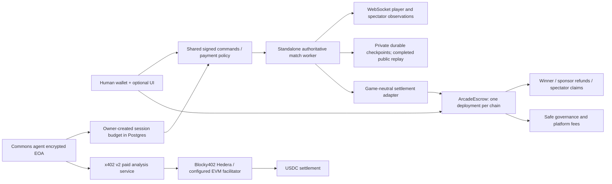

# Optional Arcade payments: integration plan and implementation record

Date: 2026-09-09. Status: local implementation and workspace checks pass; public deployment and live agent evidence remain pending.

## Repository findings

- Common Arcade `0154b92`: standalone Hono control API, long-lived match worker/gateway, deterministic `AuthoritativeMatch`, immutable releases, wallet-independent capabilities. Governing document: `docs/architecture/common-arcade-system-design.md`. Existing economy extension is descriptive metadata, not permission to charge. Payment activation must be a separate explicit per-match choice.
- Agent Commons `9cdab9c`: owner-controlled encrypted EOA wallets plus custom providers and an ERC-4337 placeholder; balances, transfers, and x402 signing were fixed to Base Sepolia. The old x402 client selected a remote quote without an owner spending policy. The old guard verified then asynchronously settled. These are insufficient for stake admission or paid access.
- Unmerged Arcade `670540f` (`feat/hedera-x402-payments`): Hedera-only HBAR escrow, Hardhat, unsigned deposit calls, independently hosted paid coach. Retain independent deployment and unsigned caller-side payments. Replace native-only accounting, mutable/unregistered seats, deposits until resolution, and operator-directed sponsor refunds. This branch was reviewed, not merged into this work.
- ProvenanceKit: `packages/provenancekit-contracts/{foundry.toml,script/Deploy.s.sol,contracts}`, SDK `src/chain.ts`. Borrow Forge, pinned compiler, optimizer/fuzzing, interfaces, chain adapters, generated ABI and per-network deployment records. Do not copy default deployer-as-admin behavior; require Safe governance explicitly.
- Covenant Convo: local `covenant-convo-draft`, `src/hooks/useNetworkCheck.ts`, `src/lib/explorer.ts`, auction ABI's pending withdrawals/payout accounting. Borrow explicit wallet chain checking and claimable withdrawals. This checkout has no Safe Protocol Kit integration to reuse; Safe integration follows its official docs.

## Architecture

`packages/economy` contains configuration, addresses, generated ABI, unsigned calls and a viem adapter. Games do not import signing keys or invoke a blockchain in their action loop. `packages/contracts` is the Forge workspace. `services/payment-service` provides independently deployable x402 analysis and the explicit testnet match demonstration using `AuthoritativeMatch`. Agent Commons talks to public boundaries; Arcade does not depend on its database or identity service.

The initial game is **blackjack duel**, a two-player contest for highest non-bust hand, with hit/stand, ace adjustment, one standard shoe, no house bankroll, no insurance/splits/doubles, and refunds for equal totals or both bust. It demonstrates the same pool settlement other single-winner games can use. Multi-winner ranked distributions require a separate reviewed payout strategy; do not silently pretend winner-take-all supports them.

## Accounting and trust

1. Free mode is the default. Escrow requires explicit per-match settings. Publishing game metadata cannot activate payments.
2. Resolve deployment from operator configuration, never a game-provided RPC URL or arbitrary contract.
3. Bind pool ID to chain, deployment, match, release and round. Commit rules, recipients, fee and shuffle commitment before accepting funds.
4. All pool values are ERC-20 atomic units. Arc's native USDC gas has 18 decimals; its ERC-20 interface has 6. Never treat them as separate balances.
5. Authorize token and resolver through Safe. The deployer retains no privileged role. Resolver can create/lock/report results; it cannot change token authorization or redirect a recorded winner.
6. Confirm the funding lock before dealing cards or broadcasting observations. Contract admission checks every required seat stake.
7. Persist completed authoritative replay before settlement. Read onchain status on retry. Never accept a browser-supplied winner.
8. Prize fee is a disclosed basis-point share of the entire prize pool (including stakes). Spectator fee applies only to the losing pool. Cancellation returns full contributions, with no fee. Nobody backed the winner: all bets refund. Last winning claimant receives rounding dust.
9. Claims use checks-effects-interactions and SafeERC20; failures revert without burning entitlements. Anyone can trigger a winner withdrawal, but cannot change its destination. Anyone can also relay sponsor refunds and spectator claims to their fixed recorded recipients.
10. Permissionless timeout cancellation protects abandoned matches. Pausing blocks deposits, not withdrawals/refunds. No asset sweep or proxy upgrades.

The testnet dealer and resolver are trusted. A server-generated secret shuffle with public commitment and completed replay permits verification that the published shuffle was followed, but cannot prove the dealer did not choose a favorable seed or leak it. Financial play must not be described as trustless. A future production fairness adapter should combine player contributions with verifiable randomness, prohibit rerolls and late wagers, and define oracle disputes before enabling real-value wagering. That is intentionally separate from the generic accounting contract.

## Agent wallet integration

Use an existing encrypted ECDSA EOA; do not create another wallet for each game. Each owner-created spending grant binds wallet, agent, runtime session, network, USDC asset, exact recipient, exact HTTPS service origin, per-payment maximum, total budget, and expiration. Reserve budget under a database row lock before signing; use a unique idempotency key. Retain reservations after uncertain responses. A failed HTTP response is not proof that an onchain payment failed. Never allow autonomous arbitrary contract calls or unlimited ERC-20 approvals.

Hedera adds a native scheme, not an EVM chain alias: resolve the EOA address to its numeric account ID using the mirror node, require account activation and HTS USDC association, then sign a native TransferTransaction through `@x402/hedera`. ERC-4337, external and custom-provider wallets need their own explicit signer adapters; the existing placeholder is not an implemented Safe session key.

x402 service fees are separate from match stakes. A facilitator's successful transfer to a service wallet cannot be treated as a deposit credit to a match pool. Stake admission is verified against contract state. The paid service exposes a discoverable, genuinely computed one-card blackjack risk analysis priced by the number of unseen cards evaluated. It never receives the secret shoe.

## Safe and deployment

Safe is the contract owner and fee recipient on each chain. Use at least two signers. The Forge public testnet deployment script checks deployed code, Safe owners and threshold. Generate a Safe Transaction Builder batch authorizing USDC and the resolver. Review code and configuration, then sign in Safe. Safe Transaction Service availability is distinct from contract availability: do not invent factory/transaction-service addresses for Arc or Hedera. The batch path avoids requiring a hosted transaction service. Existing deployment addresses must be checked against chain code and the requested owner configuration.

Public deployment remains pending user-provided Safe addresses, funded testnet wallets, resolver custody and chain-specific facilitator support. The user requested that Safe details be requested again only when the implementation is ready to go live. Do not use production keys for the demo.

## Delivery sequence and acceptance

- [x] Inspect the four repositories, existing payment branch and design boundaries.
- [x] Build game-neutral Forge escrow with token/resolver controls, immutable per-match terms, refunds, fees and claimable payouts.
- [x] Pass 16 Forge tests, including real 2-of-2 Safe execution and 512 fuzz cases.
- [x] Complete adapter, signed match API, browser controls and owner-created wallet session grants.
- [x] Prove the local Anvil flow: fixture USDC stakes, signed player actions, lock, settlement and withdrawals. Browser smoke checks cover a free match and spectator updates.
- [x] Exercise a second published Studio game through the same match API with immutable creator terms.
- [ ] Prove an authenticated Commons agent and human playing together with public testnet USDC; browser grant checks currently use mocked identity responses.
- [x] Prove local EVM x402 challenge/sign/verify/settle handling and reject failed settlement.
- [x] Test PostgreSQL concurrent budget reservation, revocation, authorization and quote constraints.
- [x] Run Arcade workspace verification and infrastructure synthesis; Commons payment tests and source typecheck pass. Full Commons test typecheck retains an existing supertest import error.
- [ ] Deploy actual testnet contracts under user Safe; authorize token/resolver through Safe.
- [ ] Run paid Blocky402 request using a Commons agent wallet and retain explorer transaction evidence.
- [ ] Run Arc USDC and Base Sepolia match; retain contract and payout transaction links.
- [ ] CI green, merge reviewed changes to main, protect production deployment.
- [ ] Record <=5 minute demo and publish setup/architecture/payment flow evidence. Do not claim bounty eligibility without these.

## Bounty mapping

Hedera AI & Agentic Payments requires a live x402-gated service **settled through Blocky402**, a platform/agent making at least one real paid request, public source/setup docs and a <=5 minute video. Contract tests, an EVM transfer on Hedera, or an unpaid 402 response do not meet that requirement.

Arc Launch / DeFi: a working USDC escrow and fee/payout flow, UI and backend, architecture, Circle technology documentation, video, and a mainnet-ready plan before the event's specified September 30 deadline. Arc Agent Stack track additionally needs actual Circle Agent Stack usage; reusing an existing Commons EOA with viem alone does not demonstrate that. Preserve the existing wallet model and offer a Circle CLI/Agent Wallets adapter as a separate integration, with explicit evidence before selecting that track.

## External patterns and sources

- [Polymarket position management](https://docs.polymarket.com/trading/positions/manage): separate outcome resolution from redemption; claim-based settlement avoids enumerating all spectators. Arcade uses a small pari-mutuel pool, not an order book or a copied conditional-token market.
- [Chainlink VRF security](https://docs.chain.link/vrf/v2-5/security): close wagers before randomness and prohibit rerolls. Useful for the funding-lock boundary and future fairness adapter; Chainlink availability on every target chain is not assumed.
- [OpenZeppelin ERC-20](https://docs.openzeppelin.com/contracts/5.x/api/token/erc20): checked token operations and explicit allowances.
- [Safe transaction execution](https://docs.safe.global/sdk/protocol-kit/guides/execute-transactions) and [network support](https://docs.safe.global/advanced/smart-account-supported-networks): threshold approval, deployment-specific support, governance separated from signing automation.
- [Arc contract addresses](https://docs.arc.io/arc/references/contract-addresses), [Arc connectivity](https://docs.arc.io/arc/references/connect-to-arc): USDC ERC-20/native precision and verified testnet identity.
- [Blocky402 networks](https://blocky402.com/docs/networks/) and [API](https://blocky402.com/docs/api-reference/): inspect `/supported` instead of assuming Arc/Base support on the hosted Hedera facilitator.
- [Hedera inference reference](https://github.com/hedera-dev/x402-inference-pay-per-request-poc): native account signer, token association and client payment loop. Use Blocky402 specifically for this bounty.
- [Circle Agent Stack](https://developers.circle.com/agent-stack): optional provider integration and explicit track requirements.
